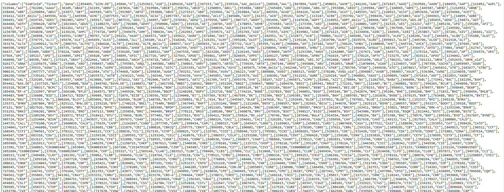

API's (Application Programming Interfaces) are crucial when it comes to applications 
communicating with each other. Today they are everywhere around us and I guess 
we cannot imagine a world without them. We are interacting with API's several times 
a day e.g. when we are using Google Maps or sending out a tweet.


In the past years many organizations have decided to use an 
[*API-first approach*](https://swagger.io/resources/articles/adopting-an-api-first-approach/#:~:text=An%20API%2Dfirst%20approach%20means,be%20consumed%20by%20client%20applications.)
for their projects. In this blogpost I want to first show how to access the SimFin API
and second how to create your own financial (or any other) report.

## SimFin

[SimFin](https://simfin.com/) stands for **sim**plifying **fin**ance and is an organization that
provides fundamental financial data about public companies for everyone.
In order to get an API-key and download data you need to register with a mail account first.
It is recommended to store the API-key in an environment variable. 
[Here](https://daattali.gitbooks.io/stat545-ubc-github-io/content/bit003_api-key-env-var.html)
is an article that describes how to do that. After having done that you are good to go.

```{r setup, include = FALSE}
library(knitr)
library(kableExtra)
options(scipen = 1, digits = 3)
opts_chunk$set(comment=NA, warning = FALSE, message = FALSE)

```

## Accessing an API

First we'll load all necessary libraries.

```{r libraries}
# required libraries
library(tidyverse) 
library(here)
library(simfinapi)
library(httr2)      # communicating with API's through R
library(lubridate)  # Handling dates
library(gt)         # Pretty tables
library(gtExtras)

# Setting theme
plotutils::set_custom_theme(base_size = 18)
```

On the simfin website you will find a link to their 
[Web API documentation](https://simfin.com/api/v2/documentation/).
We start with an easy example of communicating with the API where we'll
request a list of available companies and their SimFinId.

First we'll store our API-key in a variable and create our url (web-address) with which 
we want to talk to. This information is available in the documentation.

```{r}
my_apikey <- Sys.getenv("SIMFIN_KEY")

base_url <- "https://simfin.com/api/v2/"

endpoint <- "companies/list"

# Create url
url <- paste0(base_url, endpoint, "?api-key=", my_apikey)
```

Now we could just copy paste this url in our browser and see the result:



But fortunately there is a more elegant R package for communicating with API's.
The `{httr2}` package is an advancement of the `{httr}` package developed by 
[Hadley Wickham](https://httr2.r-lib.org/).

```{r}
# create the request
req <- request(url) |> 
  req_perform()

# Check if it worked
resp_status(req)
```

Glad to see that the request worked. Now we want to parse it's raw output.
In our case this is done via the `resp_bod_json()` function (as we are dealing with
json data - see the browser output). Then we are converting it to a dataframe/tibble.


```{r}
content_json <- resp_body_json(req) 

content_df <- tibble(simfin_id = map_dbl(content_json$data, 1),
                     ticker = map_chr(content_json$data, 2))
```

Let's have a look at the first few rows of our dataframe of available companies:

```{r echo=FALSE}
content_df |> 
  slice(1:7) |> 
  gt() |> 
  tab_header(title = "Available companies")
```

After scrolling through the first entries we recognize the AAPL ticker belonging
to Apple. Now we'll have a closer look at this company and extend our request
with more fields.

```{r}
# Define ticker. We want to have a look at Apple
ticker <- "AAPL"

# the statement to retrieve. (profit/loss)
statement <- "pl"

# the period & financial year to retrieve
period <- "q4"
fyear <- 2021

# create url
url <- paste0(base_url, "companies/statements?api-key=", my_apikey, "&ticker=", ticker, 
              "&statement=", statement, "&period=", period,"&fyear=", fyear)

# make request
apple_req <- request(url) |> 
  req_perform()

# convert JSON
apple_json <- resp_body_json(apple_req)[[1]]

apple_df <- tibble(variable = map_chr(apple_json$columns, 1),
                   value = map_chr(apple_json$data[[1]], 1, .null = NA_character_))
  
```

Now we can inspect some information for Apple's last quarter.

```{r echo = FALSE}
apple_df |> 
  slice(2,5,6,11,19, 21, 25) |> 
  gt() |> 
  tab_header(title = "Apple's 4. Quarter 2021")
```

Accessing the API in this way is somewhat cumbersome for more complex matters. 
But thankfully someone has written an R package for this as well.

Thanks to [Matthias Gomolka](https://github.com/matthiasgomolka) for maintaining
the `{simfinapi}` [R package](https://github.com/matthiasgomolka/simfinapi).
This package wraps the SimFin API and allows us an easier access.


```{r}
# Setting the api key
sfa_set_api_key(api_key = Sys.getenv("SIMFIN_KEY"))
# Setting up cache directory
sfa_set_cache_dir(here("_posts/2021-12-15-apis-and-parameterized-reports", 
                       "simfin_cache"), create = TRUE)
```

Now we can use a set of functions to retrieve the information of interest.
Our first request can be rewritten in one line as this:

```{r}
available_companies <- sfa_get_entities()
```

If we want to look at some information for a company like Apple, we would write:

```{r}
company_infos <- sfa_get_info(ticker = "AAPL")
```


# Fragestellung

Wie haben sich die Aktienkurse verschiedener sozialer Netzwerke im Jahr 
`r params$fiscal_year` entwickelt? Wurden alle Unternehmen gleichermaßen von 
Corona getroffen? Konnten Digitalunternehmen profitieren?

Für eine nähere Betrachtung und für eine Bewertung schauen wir auf eine 
interessante Zielmetrik für Digitalunternehmen. Diese lautet die Rule of 40. 

# Zusammenfassung

Generell hat sich der Aktienkurs der untersuchten Unternehmen nach einem
kurzen globalen Einbruch der Weltwirtschaft Mitte März recht schnell wieder
erholt. Insbesondere Pinterest konnte im Vergleich stärker anwachsen als die 
anderen betrachteten Unternehmen. Eine Hypothese ist, dass gerade Pinterest
von dem Rückzug in die eigenen vier Wände profitieren konnte. Auf dieser 
Plattform sind die Themen Gestaltung und Verschönern des Zuhauses, des Gartens
etc. beliebt.

Blablabla...


```{r eval = FALSE}
params:
  stocks: ["FB", "TWTR", "SNAP", "PINS"]
  fiscal_year: 2020
```


# Analyse

Hier werfen wir einen näheren Blick auf die Aktienkurse der Unternehmen.

## Aktienkurse im Jahresverlauf

```{r simfinapi, fig.height=4, fig.width=6, layout="l-body-outset"}
# Setting the api key
sfa_set_api_key(api_key = Sys.getenv("SIMFIN_KEY"))
sfa_set_cache_dir(here("_posts/2021-12-15-apis-and-parameterized-reports", 
                       "simfin_cache"), create = TRUE)

company_infos <- sfa_get_info(ticker = params$stocks)

shares <- sfa_get_prices(ticker = params$stocks) %>% 
  left_join(company_infos)

shares %>% 
  mutate(year = year(date)) %>% 
  filter(year == params$fiscal_year) %>%
  ggplot(aes(x = date, y = adj_close)) +
  geom_line() +
  facet_wrap(~company_name, scales = "free_y") +
  scale_x_date(date_breaks = "3 months", date_labels = "%b") +
  labs(x = NULL,
       y = "Kurs in $") 

shares %>% 
  mutate(year = year(date)) %>% 
  filter(year == params$fiscal_year) %>%
  ggplot(aes(x = date, y = log(adj_close), colour = company_name)) +
  geom_line(lwd = 1) +
  viridis::scale_colour_viridis(discrete = TRUE) +
  scale_x_date(date_breaks = "3 months", date_labels = "%b") +
  labs(
       subtitle = "Vergleich mit logarithmierter Y-Achse",
       x = NULL,
       y = "log($)",
       colour = NULL) 

```


Nun blicken wir auf den durchschnittlichen logarithmierten Return und seine
Standardabweichung.

```{r log returns}
mean_log_returns <- shares %>% 
  mutate(year = year(date)) %>% 
  filter(year == params$fiscal_year) %>% 
  group_by(company_name) %>% 
  summarize(mean_log_return = mean(log(adj_close)),
            sd_log_return = sd(log(adj_close)))

mean_log_returns %>% 
  gt() %>% 
  tab_header(title = "Mean Log Returns")
```


## Rule of 40

Die Rule of 40^[https://kpisense.com/glossary/rule-of-40] wird klassischerweise 
bei Software Firmen angewendet, um 
deren Entwicklung zu bewerten. Dabei sollen zwei Metriken
einfließen. Einerseits das Wachstum des Unternehmens und andererseits der
Profit. In den ersten Jahren eines Unternehmens ist es üblich, dass 
es noch keinen Profit gibt, aber Wert auf Wachstum gelegt wird. 

$$
Rule\; of\; 40 = Growth + Profit\; Margin
$$

Diese Metrik kann selbstverständlich auch gewichtet werden, falls eine der 
beiden Komponenten als relevanter erachtet wird. 

Nun schauen wir uns an wie diese Metrik für die Unternehmen am Ende des
Geschäftsjahres `r params$fiscal_year` (4. Quartal) aussieht. 


```{r rule_40}

derived_q4 <- sfa_get_statement(ticker = params$stocks,
                                fyear = params$fiscal_year,
                                period = "q4",
                                statement = "derived")

derived_q3 <- sfa_get_statement(ticker = params$stocks,
                                fyear = params$fiscal_year,
                                period = "q3",
                                statement = "derived")

profit_loss_q4 <- sfa_get_statement(ticker = params$stocks,
                                    fyear = params$fiscal_year,
                                    period = "q4",
                                    statement = "pl")

profit_loss_q3 <- sfa_get_statement(ticker = params$stocks,
                                    fyear = params$fiscal_year,
                                    period = "q3",
                                    statement = "pl")
# Define our own Metric
rule_40 <- profit_loss_q4 %>% 
  select(ticker, fiscal_year, revenue) %>%
  mutate(growth = revenue/profit_loss_q3$revenue - 1) %>% 
  inner_join(select(derived_q4, net_profit_margin, ticker)) %>% 
  mutate(rule_40 = growth + net_profit_margin,
         revenue = revenue/1e6)

rule_40 %>% 
  gt() %>% 
  tab_header(title = "Rule of 40") %>% 
  gt_color_rows(rule_40, palette = c("#AEEAE3", "#2BA193"), use_paletteer = FALSE)
```


