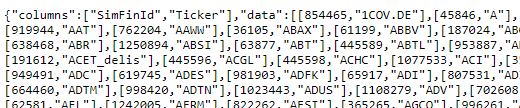

API's (Application Programming Interfaces) are crucial when it comes to applications 
communicating with each other. Today they are everywhere around us and I guess 
we cannot imagine a world without them. We are interacting with API's several times 
a day e.g. when we are using Google Maps or sending out a tweet.


In the past years many organizations have decided to use an 
[*API-first approach*](https://swagger.io/resources/articles/adopting-an-api-first-approach/#:~:text=An%20API%2Dfirst%20approach%20means,be%20consumed%20by%20client%20applications.)
for their projects. In this blogpost I want to first show how to access the SimFin API
and second how to create your own financial (or any other) report.

## SimFin

[SimFin](https://simfin.com/) stands for **sim**plifying **fin**ance and is an organization that
provides fundamental financial data about public companies for everyone.
In order to get an API-key and download data you need to register with a mail account first.
It is recommended to store the API-key in an environment variable. 
[Here](https://daattali.gitbooks.io/stat545-ubc-github-io/content/bit003_api-key-env-var.html)
is an article that describes how to do that. After having done that you are good to go.

```{r setup, include = FALSE}
library(knitr)
library(kableExtra)
options(scipen = 1, digits = 3)
opts_chunk$set(comment=NA, warning = FALSE, message = FALSE)

```

## Accessing an API

First we'll load all necessary libraries.

```{r libraries}
# required libraries
library(tidyverse) 
library(here)
library(simfinapi)
library(httr2)      # communicating with API's through R
library(lubridate)  # Handling dates
library(gt)         # Pretty tables
library(gtExtras)

# Setting theme
plotutils::set_custom_theme(base_size = 30)
```

On the simfin website you will find a link to their 
[Web API documentation](https://simfin.com/api/v2/documentation/).
We start with an easy example of communicating with the API where we'll
request a list of available companies and their SimFinId.

First we'll store our API-key in a variable and create our url (web-address) with which 
we want to talk to. This information is available in the documentation.

```{r}
my_apikey <- Sys.getenv("SIMFIN_KEY")

base_url <- "https://simfin.com/api/v2/"

endpoint <- "companies/list"

# Create url
url <- paste0(base_url, endpoint, "?api-key=", my_apikey)
```

Now we could just copy paste this url in our browser and see the result:



But fortunately there is a more elegant R package for communicating with API's.
The `{httr2}` package is an advancement of the `{httr}` package developed by 
[Hadley Wickham](https://httr2.r-lib.org/).

```{r}
# create the request
req <- request(url) |> 
  req_perform()

# Check if it worked
resp_status(req)
```

Glad to see that the request worked. Now we want to parse it's raw output.
In our case this is done via the `resp_bod_json()` function (as we are dealing with
json data - see the browser output). Then we are converting it to a dataframe/tibble.


```{r}
content_json <- resp_body_json(req) 

content_df <- tibble(simfin_id = map_dbl(content_json$data, 1),
                     ticker = map_chr(content_json$data, 2))
```

Let's have a look at the first few rows of our dataframe of available companies:

```{r echo=FALSE}
content_df |> 
  slice(1:7) |> 
  gt() |> 
  tab_header(title = "Available companies")
```

After scrolling through the first entries we recognize the AAPL ticker belonging
to Apple. Now we'll have a closer look at this company and extend our request
with more fields.

```{r}
# Define ticker. We want to have a look at Apple
ticker <- "AAPL"

# the statement to retrieve. (profit/loss)
statement <- "pl"

# the period & financial year to retrieve
period <- "q4"
fyear <- 2021

# create url
url <- paste0(base_url, "companies/statements?api-key=", my_apikey, "&ticker=", ticker, 
              "&statement=", statement, "&period=", period,"&fyear=", fyear)

# make request
apple_req <- request(url) |> 
  req_perform()

# convert JSON
apple_json <- resp_body_json(apple_req)[[1]]

apple_df <- tibble(variable = map_chr(apple_json$columns, 1),
                   value = map_chr(apple_json$data[[1]], 1, .null = NA_character_))
  
```

Now we can inspect some information for Apple's last quarter.

```{r echo = FALSE}
apple_df |> 
  slice(2, 5, 6, 11, 19, 21, 25) |> 
  gt() |> 
  tab_header(title = "Apple's 4. Quarter 2021")
```

### The {simfinapi} package

Accessing the API in this way is somewhat cumbersome for more complex matters. 
But thankfully someone has written an R package for this as well.

Thanks to [Matthias Gomolka](https://github.com/matthiasgomolka) for maintaining
the {simfinapi} [R package](https://github.com/matthiasgomolka/simfinapi).
This package wraps the SimFin API and allows us an easier access.

First we set our API-key and a cache directory for our requests.

```{r}
# Setting the api key
sfa_set_api_key(api_key = Sys.getenv("SIMFIN_KEY"))
# Setting up cache directory
sfa_set_cache_dir(here("_posts/2021-12-15-apis-and-parameterized-reports", 
                       "simfin_cache"), create = TRUE)
```

Now we can use a set of functions to retrieve the information of interest.
Our first request can be rewritten in one line as this:

```{r}
available_companies <- sfa_get_entities()
```

If we want to look at some basic information for a company like Apple, we would write:

```{r}
company_infos <- sfa_get_info(ticker = "AAPL")
```

## Reporting with R

One of the biggest strengths of R is its ability to produce beautiful reproducible reports and articles.
This is done with [{RMarkdown}](https://rmarkdown.rstudio.com/) and additional
packages like {knitr}, {distill} etc. To learn more, I recommend the 
[RMarkdown Cookbook](https://bookdown.org/yihui/rmarkdown-cookbook/) by 
Yihui Xie, Christophe Dervieux and Emily Riederer.

For our small example report we want to focus on a specific set of companies.
Let's say we want to know how the stock prices of different social media networks 
performed in 2020. Were all companies equally affected by the Corona Virus?
What we want also is to be able to change the set of companies as well as the 
year of interest programmatically when rendering the report. RMarkdown lets you
define specific parameters at the top that you can access then inside your R code chunks.

To include these parameters in our report we have to define them first in the 
YAML header of our document. In our case this may look like this:

```{r eval = FALSE}
params:
  stocks: ["FB", "TWTR", "SNAP", "PINS"]
  fiscal_year: 2020
```

Here we provide a list of stocks and the fiscal year as variables.
We can access for example the list of stocks in our script 
with `params$stocks`.

### Stock prices over the year

In this manner we can now use our parameters as arguments for the {simfinapi} functions.

```{r}
# Get company infos
company_infos <- sfa_get_info(ticker = params$stocks)

# Get stock prices of companies of interest
shares <- sfa_get_prices(ticker = params$stocks) |> 
  left_join(company_infos)
```

Now we can generate an outpot comparing the stock price development over the
year we specified before.

```{r fig.height=6, fig.width=8, layout="l-body-outset"}
shares |> 
  mutate(year = year(date)) |> 
  # Filter only prices for our year of interest
  filter(year == params$fiscal_year) |> 
  ggplot(aes(x = date, y = adj_close)) +
  geom_line() +
  scale_y_continuous(labels = scales::dollar_format()) +
  facet_wrap(~company_name, scales = "free_y") +
  scale_x_date(date_breaks = "3 months", date_labels = "%b") +
  labs(title = glue::glue("Stock prices over the year {params$fiscal_year}"),
       x = NULL,
       y = NULL)
```

We can not only filter by our parameters but also using it to dynamically 
change the title of the plot. With different scales it is hard to compare 
the development between the selected companies. That's why we'll produce a 
plot with a logarithmized y axis.


```{r fig.height=6, fig.width=8, layout="l-body-outset"}
shares |>  
  mutate(year = year(date)) |>  
  filter(year == params$fiscal_year) |> 
  ggplot(aes(x = date, y = adj_close, colour = company_name)) +
  geom_line(lwd = 1) +
  scale_y_continuous(trans = "log10", labels = scales::dollar_format()) +
  viridis::scale_colour_viridis(discrete = TRUE) +
  scale_x_date(date_breaks = "3 months", date_labels = "%b") +
  labs(title = "Comparison with logarithmized y axis",
       x = NULL,
       y = NULL,
       colour = NULL) 
```

Here we can see directly the comparison between companies and specifically the 
"Corona effect" in the middle of march. By now I guess many have seen 
logarithmized scales as they were quite popular to illustrate exponential 
growth of Corona Virus cases. The difference between 10\$ and 100\$ is the
same as the difference between 30\$ and 300\$. The social network whose share 
price has risen the most is Pinterest. One hypothesis is that Pinterest in 
particular could benefit from the retreat into the own four walls. 
On this platform, the topics of designing and decorating the home, garden etc. are popular.

### Creating your own metric

Now we don't want to only compare the development of the stock prices, but
have a deeper look at some characteristics of these companies.
The SimFin API offers a variety of variables and information.
We can access them through the {simfinapi} function `sfa_get_statement()`.
For now, we want to calculate our own metric to compare our four companies.
This metric will be the *Rule of 40*^[https://kpisense.com/glossary/rule-of-40]
which is typically applied to SaaS (Software as a Service) companies to evaluate 
their development. Two metrics will be combined here. 
One is the growth of the company and the other is profit. 
In the first years of a company, it is common that there is no profit yet, 
but an emphasis on growth. As a rule of thumb the sum of growth and profit 
should equal to at least 40. For example 50% Growth and -10% Profit Margin
would still satisfy this condition.

$$
Rule\; of\; 40 = Growth + Profit\; Margin
$$

This simple metric can, of course, also be weighted if one of the two components 
is considered more relevant. Now let's examine what this metric looks like 
for companies at the end of the fiscal year.

```{r}
# The net profit margin information is found in the "derived" statement
derived_q4 <- sfa_get_statement(ticker = params$stocks,
                                fyear = params$fiscal_year,
                                period = "q4",
                                statement = "derived")

derived_q3 <- sfa_get_statement(ticker = params$stocks,
                                fyear = params$fiscal_year,
                                period = "q3",
                                statement = "derived")

# The revenue information can be found in the pl (profit/loss) statement
profit_loss_q4 <- sfa_get_statement(ticker = params$stocks,
                                    fyear = params$fiscal_year,
                                    period = "q4",
                                    statement = "pl")

profit_loss_q3 <- sfa_get_statement(ticker = params$stocks,
                                    fyear = params$fiscal_year,
                                    period = "q3",
                                    statement = "pl")
# Define our own Metric
rule_40 <- profit_loss_q4 |> 
  select(ticker, fiscal_year, revenue) |> 
  mutate(growth = revenue/profit_loss_q3$revenue - 1) |> 
  inner_join(select(derived_q4, net_profit_margin, ticker)) |> 
  mutate(rule_40 = growth + net_profit_margin,
         revenue = revenue/1e6)
```


```{r}
rule_40 |> 
  gt() |> 
  tab_header(title = "Rule of 40") |> 
  gt_color_rows(rule_40, palette = c("#AEEAE3", "#2BA193"), use_paletteer = FALSE)
```

Pinterest reached with almost 60% the highest growth relative to the previous quarter.
Facebook - or Meta as it's now being called - had the highest profitability.
Added together only Snap was not able to satisfy the Rule of 40 metric.

In such a way, reports can now be created programmatically. If we want to 
e.g. exchange Snapchat with Google (Ticker is GOOG), we would render our report
as follows:

```{r eval = FALSE}
rmarkdown::render(my_report.Rmd, 
                  params = list(stocks = c("FB", "TWTR", "GOOG", "PINS")))
```

There are countless possibilities to create specific reporting templates and functions
for your own use cases.
A really minimal example of how such a report might look like can be found 
[here](https://github.com/L-Groeninger/lukas-r.blog/tree/main/_posts/2021-12-15-apis-and-parameterized-reports)
in the Github repo of this blogpost. The output format is of course not
limited to html, but can be PDF as well.


