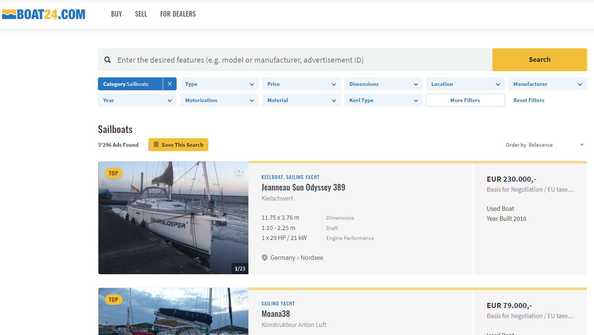
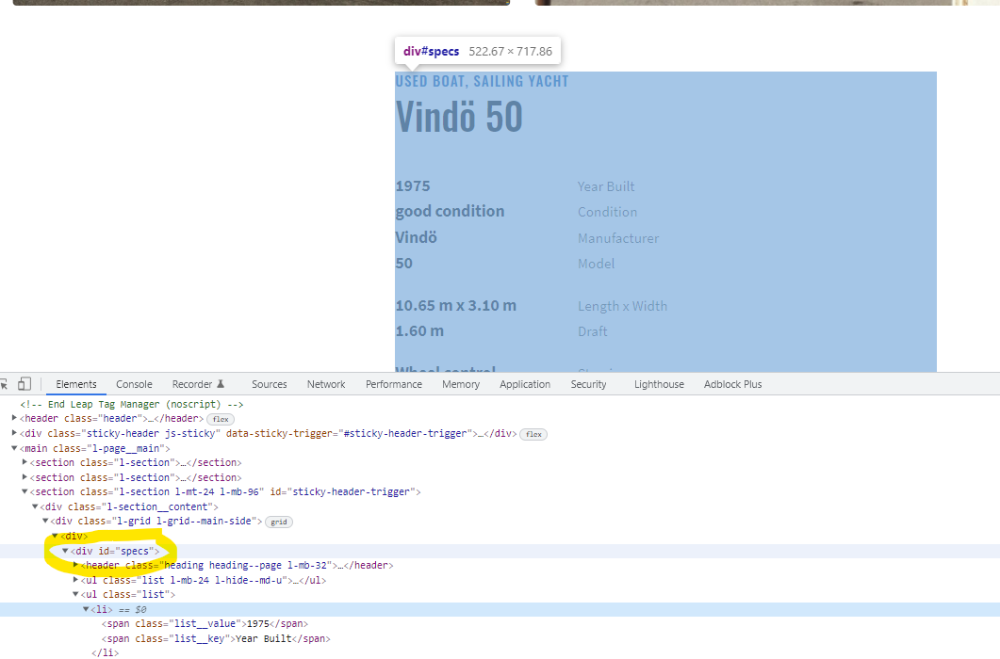

```{r setup, include = FALSE}
library(knitr)
library(kableExtra)
options(scipen = 1, digits = 3)
opts_chunk$set(comment=NA, warning = FALSE, message = FALSE)

```


```{r echo=FALSE}
# https://www.pexels.com/photo/brown-boat-on-ground-2076759/
```

# Boat24.com

In the last post I described how to use an API to download financial data.
In this post I want to talk about accessing data from the web when we don't have
the luxury of using an API. Maybe there is an interface, but it is not publicly 
available. Or there is none and we still want to extract data.
The concept we will use here is called Web Scraping. 
It is about collecting structured web data in an automated way. 
The example to demonstrate this process will be the website 
[www.boat24.com](https://www.boat24.com/en/). It is a european two sided marketplace 
to purchace or sell used sail or motorboats. I've worked on ships for some
years and enjoy going sailing during vacation. And so sometimes I end up looking at
used sailboats on the Internet... Let's have a look at their website:



We filtered for sailboats and see a list of boats and additional information.
The total number of listings is 3296 boats. The general setup of the page 
is already quite good for our task.

# Web Scraping

Now I want to access information about the 
inventory of this marketplace. We can do this by investigating the
structure of the website of interest.

<aside>Make sure that it's okay to scrape the site by looking at their [robots.txt file](https://developers.google.com/search/docs/advanced/robots/intro).</aside>
 
This means answering questions like -
*How is the content and the information loaded and displayed and what other requests are made in the background?* 
We do this by having a look at the Developer Tools Panel (if you are using a Chrome Browser).
On Windows this opens up after typing *Control+Shift+C*. 
We will use it to inspect the different elements and extract and parse the relevant html/xml.

The libraries we'll need to perform the process of extracting information from
a web page are the following: 

```{r}
library(tidyverse)  # Main data wrangling
library(rvest)      # Web scraping library
library(xml2)       # XML Parsing 
library(lubridate)  # Handling dates
```

We start by scrolling through the boats and click on a link in order to see a 
more detailed view of the specific boat listing. We see pictures of the boat 
and further information in a table below. When hovering over this table we 
see the section is called *"specs"*.



We are definitely interested in extracting this information.
But first we will set up our R script. We see that on every page there are  
20 boats listed. The starting url from where we'll navigate this site will
therefore be *https://www.boat24.com/en/sailboats/?page=0&sort=datdesc*.


```{r eval = FALSE}
# Starting url
url <- "https://www.boat24.com/en/sailboats/?page=0&sort=datdesc"

# Starting page number
page_num <- 0
```

Afterwards we'll initialize our dataframe with all the variables of interest
which we want to extract.

```{r eval = FALSE}
# Initialize Dataframe (for the moment only char-variables, will be cleaned later)
boat_df <- tibble(id = character(),
                  type = character(),
                  price = character(),
                  condition = character(),
                  manufacturer = character(),
                  model = character(),
                  region = character(),
                  location = character(),
                  year = character(),
                  length_width = character(),
                  draft = character(),
                  displacement = character(),
                  material = character(),
                  steering = character(),
                  keel_type = character(),
                  ballast = character(),
                  no_persons = character(),
                  headroom = character(),
                  no_cabins = character(),
                  no_beds = character(),
                  propulsion = character(),
                  engine_perf = character(),
                  fuel_type = character(),
                  fuel_cap = character(),
                  engine_hours = character(),
                  mainsail = character(),
                  genoa = character(),
                  spinnaker = character(),
                  ad_date = character(),
                  no_views = character(),
                  no_favs = character())
```

The process looks like this:

- Start with the landing page and find the list of boat links.
- Access each of these pages and extract relevant information.
- Go to the next page (increase the `page_num` by 20)

```{r eval = FALSE}

# Start while loop with page_num = Number of Boats displayed at the top left                
while (page_num < 3280) {
  
  website <- read_html(url)
  # Extract boatlist of website
  boat_list <- website  |>  
    html_nodes(xpath = "/html/body/main/section[2]/div/ul/li") 
  # Loop through the 20 boats on the list
  for (i in seq_along(boat_list)) {
    
    boat_link <- xml_attrs(xml_child(boat_list[[i]], 1))[2]  
    # There are some google ads which have to be filtered by this if statement
    if (str_sub(boat_link, start = 1L, end = 22L) == "https://www.boat24.com") {
      
      boat_link_site <- read_html(boat_link)
      # Read out the variables of interest with xpath or classes
      specs_table <- html_nodes(boat_link_site, 
                                xpath = "//*[@id='specs']") %>% html_text()
      
      id <- html_nodes(
        boat_link_site, 
        xpath = "//*[@id='sticky-header-trigger']/div/div/aside/section[2]/ul[1]/li[1]/strong")  |>  
        html_text() 
      type <- html_nodes(
        boat_link_site, 
        xpath = "//*[@id='specs']/header/p[1]/a[1]") |>  
        html_text() 
      price <- html_nodes(
        boat_link_site, 
        xpath = "//*[@id='contact']/div[1]/p[1]/strong")  |>  
        html_text()  
      region <- html_nodes(
        boat_link_site, 
        xpath = "//*[@id='location']/p/text()") |>  
        html_text() 
      location <- html_nodes(
        boat_link_site, 
        xpath = "//*[@id='location']/p/strong") |>  
        html_text() 
      
      condition <- str_extract(specs_table, "[^\n]+(?=Condition?)")
      manufacturer <- str_extract(specs_table, "[^\n]+(?=Manufacturer?)")
      model <- str_extract(specs_table, "[^\n]+(?=Model?)")
      year <- str_extract(specs_table, "\\d+(?=Year Built?)")
      length_width <- str_extract(specs_table, "[^\n]+(?=Length x Width?)")
      draft <- str_extract(specs_table, "[^\n]+(?=Draft?)")
      displacement <- str_extract(specs_table, "[^\n]+(?=Displacement?)")
      material <- str_extract(specs_table, "[^\n]+(?=Material?)") 
      steering <- str_extract(specs_table, "[^\n]+(?=Steering?)")
      keel_type <- str_extract(specs_table, "[^\n]+(?=Keel Type?)")
      ballast <- str_extract(specs_table, "[^\n]+(?=Ballast?)")
      no_persons <- str_extract(specs_table, "[^\n]+(?=Certified No. of Persons?)")
      headroom <- str_extract(specs_table, "[^\n]+(?=Headroom?)")
      no_cabins <- str_extract(specs_table, "[^\n]+(?=No. of Cabins?)")
      no_beds <- str_extract(specs_table, "[^\n]+(?=No. of Beds?)")
      propulsion <- str_extract(specs_table, "[^\n]+(?=Propulsion?)")
      engine_perf <- str_extract(specs_table, "[^\n]+(?=Engine Performance?)")
      fuel_type <- str_extract(specs_table, "[^\n]+(?=Fuel Type?)")
      fuel_cap <- str_extract(specs_table, "[^\n]+(?=Fuel Capacity?)")
      engine_hours <- str_extract(specs_table, "[^\n]+(?=Engine Hours?)")
      mainsail <- str_extract(specs_table, "[^\n]+(?=Mainsail?)")
      genoa <- str_extract(specs_table, "[^\n]+(?=Genoa?)")
      spinnaker <- str_extract(specs_table, "[^\n]+(?=Spinnaker?)")
      
      ad_date <- html_nodes(
        boat_link_site, 
        xpath = "//*[@id='sticky-header-trigger']/div/div/aside/section[2]/ul[1]/li[2]/strong") |>  
        html_text() 
      no_views <- html_nodes(
        boat_link_site, 
        xpath = "//*[@id='sticky-header-trigger']/div/div/aside/section[2]/ul[1]/li[3]/strong") |>  
        html_text() 
      no_favs <- html_nodes(
        boat_link_site, 
        xpath = "//*[@id='sticky-header-trigger']/div/div/aside/section[2]/ul[1]/li[4]/strong") |>  
        html_text() 
      
      # Bind variables to dataframe. Select only the first element, if empty --> NA
      df <- tibble(id = if (is_empty(id)) NA else id[[1]],
                   type = if (is_empty(type)) NA else type[[1]],
                   price = if (is_empty(price)) NA else price[[1]],
                   condition = if (is_empty(condition)) NA else condition[[1]],
                   manufacturer = if (is_empty(manufacturer)) NA else manufacturer[[1]],
                   model = if (is_empty(model)) NA else model[[1]],
                   region = if (is_empty(region)) NA else region[[1]],
                   location = if (is_empty(location)) NA else location[[1]],
                   year = if (is_empty(year)) NA else year[[1]],
                   length_width = if (is_empty(length_width)) NA else length_width[[1]],
                   draft = if (is_empty(draft)) NA else draft[[1]],
                   displacement = if (is_empty(displacement)) NA else displacement[[1]],
                   material = if (is_empty(material)) NA else material[[1]],
                   steering = if (is_empty(steering)) NA else steering[[1]],
                   keel_type = if (is_empty(keel_type)) NA else keel_type[[1]],
                   ballast = if (is_empty(ballast)) NA else ballast[[1]],
                   no_persons = if (is_empty(no_persons)) NA else no_persons[[1]],
                   headroom = if (is_empty(headroom)) NA else headroom[[1]],
                   no_cabins = if (is_empty(no_cabins)) NA else no_cabins[[1]],
                   no_beds = if (is_empty(no_beds)) NA else no_beds[[1]],
                   propulsion = if (is_empty(propulsion)) NA else propulsion[[1]],
                   engine_perf = if (is_empty(engine_perf)) NA else engine_perf[[1]],
                   fuel_type = if (is_empty(fuel_type)) NA else fuel_type[[1]],
                   fuel_cap = if (is_empty(fuel_cap)) NA else fuel_cap[[1]],
                   engine_hours = if (is_empty(engine_hours)) NA else engine_hours[[1]],
                   mainsail = if (is_empty(mainsail)) NA else mainsail[[1]],
                   genoa = if (is_empty(genoa)) NA else genoa[[1]],
                   spinnaker = if (is_empty(spinnaker)) NA else spinnaker[[1]],
                   ad_date = if (is_empty(ad_date)) NA else ad_date[[1]],
                   no_views = if (is_empty(no_views)) NA else no_views[[1]],
                   no_favs = if (is_empty(no_favs)) NA else no_favs[[1]])
      
    }
    # Rowbind the dataframe 
    boat_df <- bind_rows(boat_df, df)
    
  }
  # Jump to the next page in steps of 20 (boats per page)
  page_num <- page_num + 20
  url <- paste0("https://www.boat24.com/en/sailboats/?page=", 
                as.character(page_num), "&sort=datdesc")
    
}
  

# Write dataset
# write_csv(boat_df, file = "Boats/Data/sailboats3.csv")
df <- read_csv("Boats/Data/sailboats3.csv", col_types = cols(.default = "c"))

```


# Data Cleaning

```{r eval = FALSE}

cleaned_df <- df |>  
  drop_na(id) |> 
  distinct(id, .keep_all = TRUE) |> 
  separate(col = engine_perf, into = c("no_eng", "hp_eng"), sep = "x") |>  
  separate(col = length_width, into = c("length", "width"), sep = "x") |> 
  mutate(currency = str_sub(price, 1, 1),
         price = parse_number(price, 
                              locale = locale(decimal_mark = ",", 
                                              grouping_mark = ".")),
         hp_eng = str_extract(hp_eng, pattern = "(\\d)+(?= HP)"),
         displacement = parse_number(displacement,
                                     locale = locale(grouping_mark = "'")),
         across(.cols = c(no_persons, draft, no_cabins, no_beds, headroom, fuel_cap, 
                engine_hours, no_views, no_favs, ballast, mainsail, genoa, year,
                spinnaker, no_eng, hp_eng, length, width),
                .fns = parse_number),
         region = case_when(str_detect(region, "United Kingdom") ~ "United_Kingdom",
                            str_detect(region, "United States") ~ "USA",
                            TRUE ~ region),
         country = str_extract(region, pattern = "\\w+"),
         price = case_when(currency == "£" ~ price*1.18,
                           currency == "C" ~ price*0.9,
                           currency == "D" ~ price*0.13,
                           currency == "E" ~ price*1,
                           currency == "S" ~ price*0.1,
                           currency == "U" ~ price*0.85,
                           TRUE ~ NA_real_),
         ad_date = dmy(ad_date))

```


What are the most interesting boats?

The ones with a high favorites/no. views ratio.


```{r eval = FALSE}
boat_df |> 
  filter(year > 1995 & 
         base_type == "Sailboat" & 
         between(length, 8, 12) &
         between(price, 30000, 80000)) |> view()

df_e |> select(no_views, no_favs) |> arrange(no_favs) |> view()
```


 

