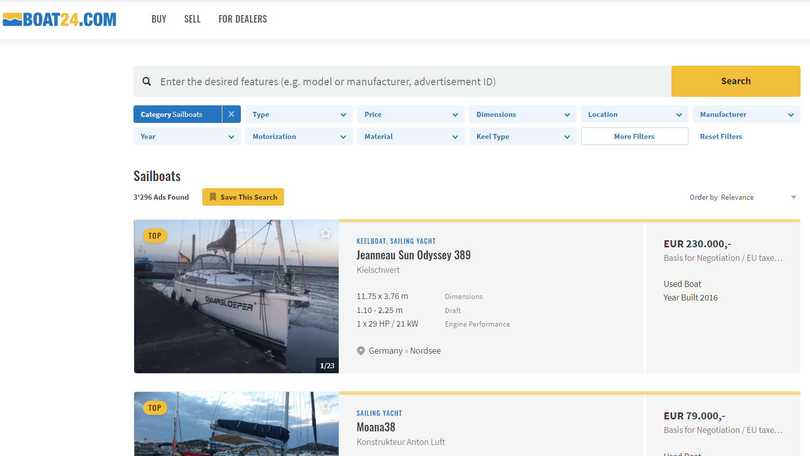
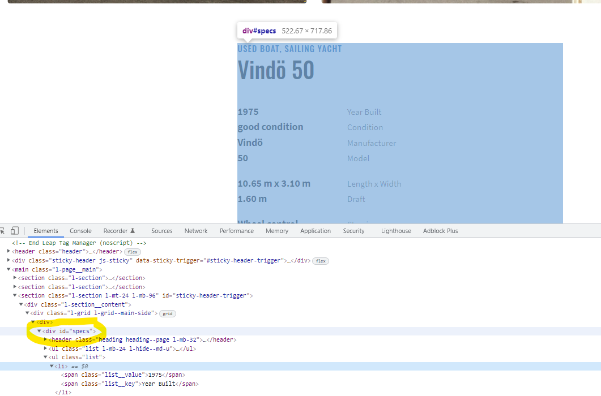

```{r setup, include = FALSE}
library(knitr)
library(kableExtra)
library(rmarkdown)
options(scipen = 1, digits = 3)
opts_chunk$set(comment=NA, warning = FALSE, message = FALSE)

```


In the last post I described how to use an API to download financial data.
In this post I want to talk about accessing data from the web when we don't have
the luxury of using an API. Maybe there is an interface, but it is not publicly 
available. Or there is none and we still want to extract data.
The concept we will use here is called Web Scraping. 
It is about collecting structured web data in an automated way. 
The example to demonstrate this process will be the website 
[www.boat24.com](https://www.boat24.com/en/). 


It is a european two sided marketplace 
to purchace or sell used sailing or motorboats. I've worked on ships for some
years and enjoy going sailing during vacation. And so sometimes I end up looking at
used sailboats on the Internet... Today the goal is to scrape information 
from this site.

Let's have a look:



We filtered for sailboats and see a list of boats and additional information.
The total number of listings is 3296 boats. The general setup of the page 
is already quite good for our task.

# Web Scraping

Now I want to access information about the 
inventory of this marketplace. We can do this by investigating the
structure of the website of interest.

<aside>Make sure that it's okay to scrape the site by looking at their [robots.txt file](https://developers.google.com/search/docs/advanced/robots/intro).</aside>
 
This means answering questions like -
*How is the content and the information loaded and displayed and what other requests are made in the background?* 
We do this by having a look at the Developer Tools Panel (if you are using a Chrome Browser).
On Windows this opens up after typing *Control+Shift+C*. 
We will use it to inspect the different elements and extract and parse the relevant html/xml.

The libraries we'll need to perform the process of extracting information from
a web page are the following: 

```{r}
library(tidyverse)  # Main data wrangling
library(rvest)      # Web scraping library
library(xml2)       # XML Parsing 
library(lubridate)  # Handling dates
library(sf)

# Setting theme
plotutils::set_custom_theme(base_size = 26)
```

We start by scrolling through the boats and click on a link in order to see a 
more detailed view of the specific boat listing. We see pictures of the boat 
and further information in a table below. When hovering over this table we 
see the section is called *"specs"*.



We are definitely interested in extracting this information.
To identify this table we can right click and copy the xpath.
But first we will set up our R script. We see that on every page there are  
20 boats listed. The starting url from where we'll navigate this site will
therefore be *https://www.boat24.com/en/sailboats/?page=0&sort=datdesc*.


```{r eval = FALSE}
# Starting url
url <- "https://www.boat24.com/en/sailboats/?page=0&sort=datdesc"

# Starting page number
page_num <- 0
```

Afterwards we'll initialize our dataframe with all the variables of interest
that we want to extract.

```{r eval = FALSE}
# Initialize Dataframe (for the moment only char-variables, will be cleaned later)
boat_df <- tibble(id = character(),
                  type = character(),
                  price = character(),
                  condition = character(),
                  manufacturer = character(),
                  model = character(),
                  region = character(),
                  location = character(),
                  year = character(),
                  length_width = character(),
                  draft = character(),
                  displacement = character(),
                  material = character(),
                  steering = character(),
                  keel_type = character(),
                  ballast = character(),
                  no_persons = character(),
                  headroom = character(),
                  no_cabins = character(),
                  no_beds = character(),
                  propulsion = character(),
                  engine_perf = character(),
                  fuel_type = character(),
                  fuel_cap = character(),
                  engine_hours = character(),
                  mainsail = character(),
                  genoa = character(),
                  spinnaker = character(),
                  ad_date = character(),
                  no_views = character(),
                  no_favs = character())
```

The process looks like this:

- Start with the landing page and find the list of boat links.
- Access each of these pages and extract relevant information.
- Go to the next page (increase the `page_num` by 20) and repeat.

I will break it down into several steps.

```{r eval = FALSE}
# Start while loop with page_num = Number of Boats displayed at the top left                
while (page_num < 3280) {
  
  website <- read_html(url)
  # Extract boatlist of website
  boat_list <- website  |>  
    html_nodes(xpath = "/html/body/main/section[2]/div/ul/li")
```

We'll use the `read_html()` function from the {rvest} package to extract all
of the html. with `html_nodes()` we can specify which segment we want to read.
We are interested in the links of the detail pages of the boats.
With the help of the developer tool view we can select the element of interest, right click and
copy the xpath. In the case of the *specs* table this was "//*[\@id='specs']".
For the ID, the price or the number of views, there are different xpaths which
can be found by inspecting the elements of the site.

In order to extract the relevant information we need to use some regular 
expressions (regex). To extract the condition of the boat we use for example a 
lookahead *"[^\n]+(?=Condition?)"*.

```{r eval = FALSE}
# Loop through the 20 boats on the list
  for (i in seq_along(boat_list)) {
    
    boat_link <- xml_attrs(xml_child(boat_list[[i]], 1))[2]  
    # There are some google ads which have to be filtered by this if statement
    if (str_sub(boat_link, start = 1L, end = 22L) == "https://www.boat24.com") {
      
      boat_link_site <- read_html(boat_link)
      # Read out the variables of interest with xpath or classes
      specs_table <- html_nodes(boat_link_site, 
                                xpath = "//*[@id='specs']") %>% html_text()
      
      id <- html_nodes(
        boat_link_site, 
        xpath = "//*[@id='sticky-header-trigger']/div/div/aside/section[2]/ul[1]/li[1]/strong")  |>  
        html_text() 
      type <- html_nodes(
        boat_link_site, 
        xpath = "//*[@id='specs']/header/p[1]/a[1]") |>  
        html_text() 
      price <- html_nodes(
        boat_link_site, 
        xpath = "//*[@id='contact']/div[1]/p[1]/strong")  |>  
        html_text()  
      region <- html_nodes(
        boat_link_site, 
        xpath = "//*[@id='location']/p/text()") |>  
        html_text() 
      location <- html_nodes(
        boat_link_site, 
        xpath = "//*[@id='location']/p/strong") |>  
        html_text() 

      condition <- str_extract(specs_table, "[^\n]+(?=Condition?)")
      manufacturer <- str_extract(specs_table, "[^\n]+(?=Manufacturer?)")
      model <- str_extract(specs_table, "[^\n]+(?=Model?)")
      year <- str_extract(specs_table, "\\d+(?=Year Built?)")
      length_width <- str_extract(specs_table, "[^\n]+(?=Length x Width?)")
      draft <- str_extract(specs_table, "[^\n]+(?=Draft?)")
      displacement <- str_extract(specs_table, "[^\n]+(?=Displacement?)")
      material <- str_extract(specs_table, "[^\n]+(?=Material?)") 
      steering <- str_extract(specs_table, "[^\n]+(?=Steering?)")
      keel_type <- str_extract(specs_table, "[^\n]+(?=Keel Type?)")
      ballast <- str_extract(specs_table, "[^\n]+(?=Ballast?)")
      no_persons <- str_extract(specs_table, "[^\n]+(?=Certified No. of Persons?)")
      headroom <- str_extract(specs_table, "[^\n]+(?=Headroom?)")
      no_cabins <- str_extract(specs_table, "[^\n]+(?=No. of Cabins?)")
      no_beds <- str_extract(specs_table, "[^\n]+(?=No. of Beds?)")
      propulsion <- str_extract(specs_table, "[^\n]+(?=Propulsion?)")
      engine_perf <- str_extract(specs_table, "[^\n]+(?=Engine Performance?)")
      fuel_type <- str_extract(specs_table, "[^\n]+(?=Fuel Type?)")
      fuel_cap <- str_extract(specs_table, "[^\n]+(?=Fuel Capacity?)")
      engine_hours <- str_extract(specs_table, "[^\n]+(?=Engine Hours?)")
      mainsail <- str_extract(specs_table, "[^\n]+(?=Mainsail?)")
      genoa <- str_extract(specs_table, "[^\n]+(?=Genoa?)")
      spinnaker <- str_extract(specs_table, "[^\n]+(?=Spinnaker?)")
      
      ad_date <- html_nodes(
        boat_link_site, 
        xpath = "//*[@id='sticky-header-trigger']/div/div/aside/section[2]/ul[1]/li[2]/strong") |>  
        html_text() 
      no_views <- html_nodes(
        boat_link_site, 
        xpath = "//*[@id='sticky-header-trigger']/div/div/aside/section[2]/ul[1]/li[3]/strong") |>  
        html_text() 
      no_favs <- html_nodes(
        boat_link_site, 
        xpath = "//*[@id='sticky-header-trigger']/div/div/aside/section[2]/ul[1]/li[4]/strong") |>  
        html_text()
```

After having stored all information in variables we fill them in a dataframe/tibble.
For some boats there were missing variables which had to be coded as `NA`.
We can write a short function to do that.

```{r}
# Function to select only the first element, if empty --> NA
check_input <- function(x) if (is_empty(x)) NA else x[[1]]
```


```{r eval = FALSE}
      extracted_vars <- list(id, type, price, condition, manufacturer, model, region,
                             location, year, length_width, draft, displacement,
                             material, steering, keel_type, ballast, no_persons,
                             headroom, no_cabins, no_beds, propulsion, engine_perf,
                             fuel_type, fuel_cap, engine_hours, mainsail, genoa,
                             spinnaker, ad_date, no_views, no_favs)

      df <- extracted_vars |> 
        set_names(colnames(boat_df)) |> 
        map_df(check_input) 
      
    }
    # Rowbind the dataframe 
    boat_df <- bind_rows(boat_df, df)
  }
```

Afterwards the dataframe is appended to our previously created one.
Then we have to increase the `page_num` counter and go to the next page.


```{r eval = FALSE}
# Jump to the next page in steps of 20 (boats per page)
  page_num <- page_num + 20
  url <- paste0("https://www.boat24.com/en/sailboats/?page=", 
                as.character(page_num), "&sort=datdesc")
}
```

In the end we can save our final dataframe as a csv or any other file format.
Now we'll look at the first entries of our data:

```{r include=FALSE}
boat_df <- read_csv(here::here("_posts/2022-01-10-scraping-used-boats/data", 
                               "sailboats3.csv"), 
               col_types = cols(.default = "c"))

```


```{r layout="l-body-outset"}
boat_df |> 
  head(3) |> 
  paged_table()
```

For simplicity the variables are all encoded as character. 
The next step is to clean the data.

# Data Cleaning

The main function to clean the data is the `readr::parse_number()` function.
With `across()` we can apply this function to several variables.
Another aspect is the fact that the prices are not displayed in a consistent format.
That's why I had to extract the currency and convert all prices in Euro.


```{r eval = FALSE}
cleaned_df <- boat_df |>  
  drop_na(id) |> 
  distinct(id, .keep_all = TRUE) |> 
  separate(col = engine_perf, into = c("no_eng", "hp_eng"), sep = "x") |>  
  separate(col = length_width, into = c("length", "width"), sep = "x") |> 
  mutate(currency = str_sub(price, 1, 1),
         price = parse_number(price, 
                              locale = locale(decimal_mark = ",", 
                                              grouping_mark = ".")),
         hp_eng = str_extract(hp_eng, pattern = "(\\d)+(?= HP)"),
         displacement = parse_number(displacement,
                                     locale = locale(grouping_mark = "'")),
         across(.cols = c(no_persons, draft, no_cabins, no_beds, headroom, fuel_cap, 
                engine_hours, no_views, no_favs, ballast, mainsail, genoa, year,
                spinnaker, no_eng, hp_eng, length, width),
                .fns = parse_number),
         region = case_when(str_detect(region, "United Kingdom") ~ "United_Kingdom",
                            str_detect(region, "United States") ~ "USA",
                            TRUE ~ region),
         country = str_extract(region, pattern = "\\w+"),
         price = case_when(currency == "£" ~ price*1.18,
                           currency == "C" ~ price*0.9,
                           currency == "D" ~ price*0.13,
                           currency == "E" ~ price*1,
                           currency == "S" ~ price*0.1,
                           currency == "U" ~ price*0.85,
                           TRUE ~ NA_real_),
         ad_date = dmy(ad_date))

```

# Further steps

Now we could do some analysis, picking our favorite boat etc. We could calculate 
statistics of which boats get the most views or are getting marked as 
favorites most often. We could try to answer questions like -
*Does the country where I sell my boat has an impact on the price?* and so on.


# Geographical Representation

At last I will give a geographical view on how many boats are listed in different
european countries. Here I use a dataframe where I scraped information from not only sailing
but motorboats as well. To plot it on a map, there are packages like 
`rnaturalearth` or `spData` which offer datasets for spatial analysis.
There are lots of great [tutorials](https://r-spatial.org/r/2018/10/25/ggplot2-sf-3.html) 
which show how to do that. I work with [*simple Features (sf)*](https://r-spatial.github.io/sf/) 
objects and {ggplot2}.

```{r include=FALSE}
df_e <- readRDS(here::here("_posts/2022-01-10-scraping-used-boats/data", 
                               "df_e.RDS")) |> 
  select(id, country, geom, iso_a2) |> 
  group_by(country) |> 
  summarize(n_listings = n(),
            geom = geom) |> 
  distinct(country, .keep_all = T) |> 
  filter(!st_is_empty(geom)) |>  
  st_as_sf(sf_column_name = "geom")
```


```{r fig.height=7, fig.width=7, layout="l-body-outset"}
ggplot() +
  geom_sf(data = df_e, aes(fill = n_listings)) +
  coord_sf(xlim = c(-15, 45), ylim = c(32, 70), expand = FALSE) +
  scale_fill_viridis_c(direction = -1) +
  labs(fill = "Number of listings") +
  guides(fill = guide_colorbar(title.position = "top", 
                                title.hjust = .5, 
                                barwidth = 10, 
                                barheight = 1))
```

We can directly see that this marketplace focuses mainly on the german/swiss market.
The portfolio of boats outside of Central/Western Europe is negligible.

# Conclusion

In this post I wanted to show how to scrape information from a webpage.
It is a useful skill to be able to analyze the structure of websites
and see how they are built. I went with the Boat24.com example as I am interested
in sailing yachts but the use cases are quite diverse.
The Internet offers the largest source of data and with Webscraping it can be accessed.
You could use it to compare prices of products on different websites, monitor competitors or
just for general research tasks.


 

