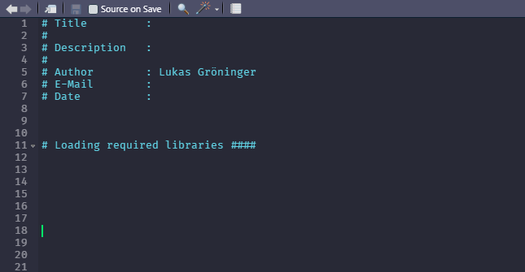
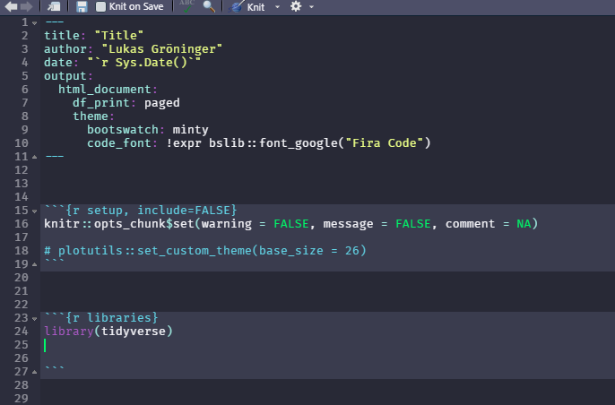
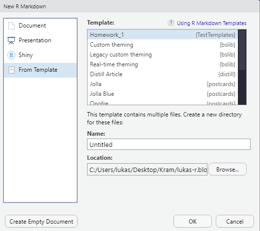

```{r setup, include = FALSE}
library(knitr)
library(kableExtra)
options(scipen = 1, digits = 3)
opts_chunk$set(comment=NA, warning = FALSE, message = FALSE)

```

## Introduction

This post is about setting up new standard R and R-Markdown files to help you 
benefit from the **default effect**.
This effect makes use of the fact that people are inherently lazy. 
We suffer from the status quo bias. That means we tend to leave things as they are. 
This is why we just agree to General Terms and Conditions and accept all cookie 
tracking on websites. Companies and organizations are well aware of this flaw 
of ours and take advantage of it.
This means we can leverage this behaviour as well to e.g. improve our code documentation.
It is good practice to design decision architectures to "Improving decisions 
about health, wealth, and happiness" [@thaler_nudge_2009].

<aside> You will find lots of literature on the topic in the field of behavioural
economics. Prominent authors are Daniel Kahnemann (*Thinking, fast and slow*) 
and Richard Thaler (*Nudge*) </aside>


## What are good standards?

Code documentation is crucial for: 

- Maintainability 
- Reproducibility 
- General knowledge transfer


When we create a new script we often don't bother to give it a title, date or a short
description about it's purpose and further information. 
After all, we know exactly what we need it for, right? The problem is that this
is not the case in 4 or 5 months from now. And even less if someone else wants 
to understand why this script exists.
But we can set ourselves up for success by using smart default templates.

**Disclaimer:**

I will demonstrate how to change the default templates on a Windows machine
using RStudio. The process for Macs and another IDE will look different.


## Creating default R templates


Currently when we go to New File -> R Script or type *Ctrl+Shift+N* we see 
an empty script. To change that we have to create a templates folder first.
In this new folder we'll create a new default.R file. 
Now we can edit this file as we like.

```{r eval = FALSE}
# Required libraries
library(fs)
library(usethis)

# Create a templates folder
dir_create(path = "~/AppData/Roaming/RStudio/templates")

# Create the file, here we start with a normal R script
file_create("~/AppData/Roaming/RStudio/templates/default.R")

# Open the file in RStudio to edit it
edit_file("~/AppData/Roaming/RStudio/templates/default.R")
```

It is helpful to specify some meta information
like Author, E-Mail or Date especially when these scripts are being shared with others.
Another aspect is to use the code folding feature (shown in line 11).

The result might look like this:



We can do now the same for R-Markdown files. The procedure is the same.

```{r eval = FALSE}
# Now we do the same with an RMarkdown Script
file_create("~/AppData/Roaming/RStudio/templates/default.Rmd")

# And open the file in RStudio again
edit_file("~/AppData/Roaming/RStudio/templates/default.Rmd")

```

Here the template is somewhat more verbose.
Often you know what things you enter repeatedly. 
These templates may look different for everyone.




## The next step

You can not only create default templates for your local machine.
The next step would be to create an R package for the sole purpose of 
containing a set of standardized default templates for e.g. your organization or
your team. Let's imagine you work in a company and you want to create specific reports 
on a regular basis. This would be a good use case to create a template for that.

[Here](https://rstudio4edu.github.io/rstudio4edu-book/rmd-templates.html) is a great 
resource for doing that. I used it to create the 
[{TestTemplates}](https://github.com/L-Groeninger/test_templates) package.
Now everyone can just install the package and be able to use your templates.



## Conclusion

In this post I went through the process of setting up default R templates.
They do not ensure that all at once your code structure will be perfect.
The idea is to reflect and work out how standards should be constructed for your particular
case. The purpose of these templates is only to nudge us in the right direction 
towards a good code structure as well as programming practices.


