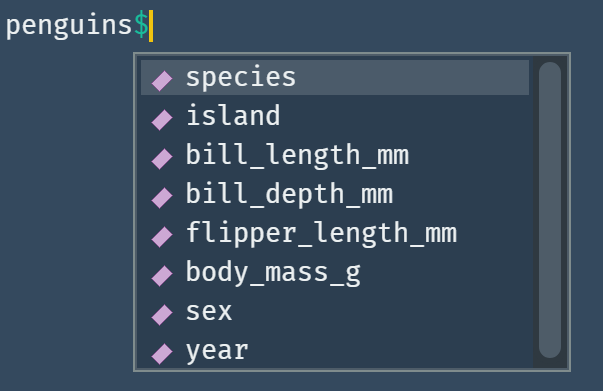

```{r setup, include=FALSE}
library(knitr)
library(kableExtra)
library(rmarkdown)
options(scipen = 100000, digits = 3)
opts_chunk$set(comment=NA, warning = FALSE, message = FALSE)

```


The R language has some peculiarities. One of these is the use of 
non-standard evaluation (NSE) and the notion of Metaprogramming.
I'm using R for quite some time now and these concepts have already given me 
some serious headaches (and will probably continue to do so...). 
Nevertheless, I have become a friend of this concept and enjoy using it.
In the first two years of using R (it was my first programming language), 
I have not given a single thought to this idea, because I didn't need it at all.
Furthermore, I didn't even question why the following was working:

```{r}
library(dplyr)

mtcars |> filter(cyl == 6)
```

How does R know where to find `cyl` and why does both `library(dplyr)` and 
`library("dplyr")` work?

I don't recall which problem I tried to fix, but one day I landed on a stackoverflow thread 
where one solution used the `!!` (bang-bang) operator. I have never seen it before and was puzzled. 
I copied the code and was glad that it worked, but I had no idea why. 
The more I started to define my own functions, the more I stumbled across this
strange topic of non standard evaluations and Metaprogramming. There were more than a
handful of expressions (`r emo::ji("wink")`) I couldn't grasp. Examples are:


- Quasiquotation
- `!!` (Bang-Bang Operator) 
- `...` (Dynamic dots)
- Data Masking
- `!!!` (Big Bang or unquote-splice Operator) 
- Defusing an expression
- `{{}}` (Embrace, Curly-Curly or Doublestashe Operator)
- Closures
- Quosures


All of these concepts seem highly complex and difficult and this post is not 
about trying to explain all or any of them in detail. For an R Beginner I feel
these topics are quite intimidating and for me they would have been overwhelming and deterring.
But have no fear, there are great ressources out there
in the [{rlang}](https://rlang.r-lib.org/index.html) documentation as well as in 
the [Big Picture Chapture](https://adv-r.hadley.nz/meta-big-picture.html) of
Advanced R. What also helped me a lot was the [Tidy Evaluation](https://tidyeval.tidyverse.org/sec-up-to-speed.html)
book by Lionel Henry and Hadley Wickham. In particular, the difference and the use cases between 
the Bang-Bang (`!!`) and the Big-Bang (`!!!`) operator became much clearer after reading it.


So what is this post about then? It should serve as a ressource (for myself and potentially others) 
to find helpful articles/posts or videos on the topic
and to provide an example of how I use non standard evaluation in exploratory data
analysis. 

<aside> I remember being really impressed after having seen how [David Robinson](https://www.youtube.com/watch?v=42GyyDM3Uzg)
used custom functions for interactive data exploration. </aside>


### List of helpful Ressources

#### Blog Posts

- [Programming with Dplyr](https://dplyr.tidyverse.org/articles/programming.html) article
- [Tips on non-standard evaluation](https://renkun.me/2014/12/03/tips-on-non-standard-evaluation-in-r/) by Kun Ren
- [Standard and non standard evaluation](https://www.brodieg.com/2020/05/05/on-nse/) and [On quosures](https://www.brodieg.com/2020/08/11/quosures/#:~:text=rlang%3A%3Aquo%20is%20used,relation%20to%20base%3A%3Aenquote%20.) by Brodie Gaslam
- [Tidy Eval is confusing sometimes](https://www.kelly-bodwin.com/blog/tidyeval/) by Kelly Bodwin

#### Forum Threads

- [quo vs enquo](https://stackoverflow.com/questions/53067407/tidyeval-quo-vs-enquo) on stackoverflow
- [Tidy Eval use cases](https://community.rstudio.com/t/interesting-tidy-eval-use-cases/21121) on R-Studio Community

#### Videos

- [Tidy Evaluation in 5 mins](https://www.youtube.com/watch?v=nERXS3ssntw) by Hadley Wickham
- [Useful Tidy Evaluation in R](https://www.youtube.com/watch?v=d2v43jJqn4I) by Connor Krenzer
- [Lazy Evaluation](https://www.youtube.com/watch?v=2BXPLnLMTYo) by Jenny Bryan


### An example of using NSE

I mainly use the Tidy eval framework in the realm of interactive data exploration 
and visualization. Here I will show how to apply it to create count summaries for
multiple variables of a dataframe. I'll use the `tabyl()` function from the 
{janitor} package. Often I just want to have a short look at all distinct values of
a variable and the corresponding percentages. This is exactly what `tabyl` allows us to 
do. We start by loading the required libraries.


```{r}
# Required libraries

library(dplyr)
library(purrr)
library(palmerpenguins) # Penguins Dataset to explore

```

The dataset for which we want to create count summaries is the penguins dataset
from the {palmerpenguins} package. This is a classic dataset to play around with
and offers eight variables.



I really like this *preview* behaviour when accessing named lists or dataframes. 
What I also find enormously useful is the tidyselect syntax. Often the structure 
of variables in a dataframe follows a certain system. In this case we have variables
that show directly in which metric they are measured (e.g. `bill_length_mm`). 
Tidyselect helpers offer a way to utilize this structure when selecting
variables. There are several possibilities:^[[Here](https://tidyselect.r-lib.org/reference/language.html) is a list with further examples]

```{r eval=FALSE}
# Selecting all variables measured in mm
select(penguins, ends_with("_mm"))

# Selecting all variables containing the word "bill"
select(penguins, contains("bill"))

# Selecting all variables from island up to sex
select(penguins, island:sex)

# Selecting specific variables
select(penguins, c(island, sex, year))

```


Let's have a look at the output when using `tabyl`. We want to look at the
gender or sex values of penguins in our dataset.

```{r}
janitor::tabyl(penguins, sex)
```

Here we see that we get the count of distinct values and (valid) percentages. 
I want to store information like this for multiple variables in a named summary list.
So how do I approach this problem?

As Jenny Bryan said in her [Lazy evaluation talk](https://www.youtube.com/watch?v=2BXPLnLMTYo)
you probably don't have to go too deep in the rlang tidy evaluation framework. 
In many cases you can *"just pass the dots"*. This refers to the `...` (Dynamic dots or forwarding)
operator where you can collect multiple arguments to e.g. `select()` or `group_by()`
calls. 


```{r}
# Creating my custom var_summary function with `...`
var_summary <- function(df, ...) {
  # Extract the column names in a character vector
  col_names <- df |>
    # Now I use the tidyselect helpers of the second argument
    select(...) |>
    names()
  
  # Map over the character column names and create the count summary
  # In the end we want to name our so created list
  col_names |>
    map(~janitor::tabyl(df, !!sym(.x)) |> 
          arrange(desc(n)) |> 
          mutate(cum_percent = cumsum(percent))) |>
    set_names(col_names)
}

# Test the function
var_sum <- var_summary(penguins, ends_with("_mm"))
  
```


Besides the `...` argument the `!!sym(.x)` stands out 
as a hint at a NSE pattern. What the `sym()` function does in our case is converting 
the character column name into a symbol that can be used as the second argument
to the `tabyl()` function. This has to be evaluated through the use of the Bang-Bang
operator. Let's look at an example:


```{r}
# Define a character column name of our dataframe
col_name <- "sex"

# Convert to symbol
sym_col_name <- sym(col_name)

# Force evaluation of symbol in the context of the tabyl function
var_sum <- janitor::tabyl(penguins, !!sym_col_name)

var_sum
```


Great, but there is also another possibility we can use as a second argument to
our created function. The `{{}}` doublestache operator (term coined by Kelly Bodwin)
which was introduced in rlang 0.4.0 (2019) can be used exactly for our use case of
variable selection. Here we just exchange the `...` with the `{{}}`. 

```{r}
# Creating my custom var_summary function with the doublestache operator
var_summary <- function(df, vars) {
  # Extract the column names in a character vector
  col_names <- df |>
    # Now I use the tidyselect helpers of the second argument
    select({{vars}}) |>
    names()
  
  # Map over the character column names and create the count summary
  # In the end we want to name our so created list
  col_names |>
    map(~janitor::tabyl(df, !!sym(.x)) |> 
          arrange(desc(n)) |> 
          mutate(cum_percent = cumsum(percent))) |>
    set_names(col_names)
}

# Test the function
var_sum <- var_summary(penguins, c(species, island, sex))
```

When reading about the tidyselect helper functions I thought it is probably
possible to just extract the character vector of column names without the
overhead of `select`-ing all the variables.
And exactly for this purpose `tidyselect::eval_select()` exists. 
It evaluates a tidyselect expression like for example `starts_with("bill")` in 
the context of a dataframe and returns a named integer vector with column names
and position:

```{r}
# Capture an expression
expression <- expr(starts_with("bill"))

# Evaluating the selection in the dataframe environment
tidyselect::eval_select(expression, data = penguins)

```

The use of `tidyselect::eval_select()` leads to a slightly faster implementation
of the function. 


```{r}
# Creating my custom var_summary function using eval_select()
var_summary <- function(df, vars) {
  expression <- rlang::enquo(vars)
  col_names <- tidyselect::eval_select(expression, data = df) |>
    names()
  col_names |>
    map(~janitor::tabyl(df, !!sym(.x)) |> 
          arrange(desc(n)) |> 
          mutate(cum_percent = cumsum(percent))) |>
    set_names(col_names)
}

var_sum <- var_summary(penguins, starts_with("bill"))

```

### Conclusion 


In the end I created three different functions which did the same job highlighting
different possibilities of how to use tidyeval/NSE patterns.


