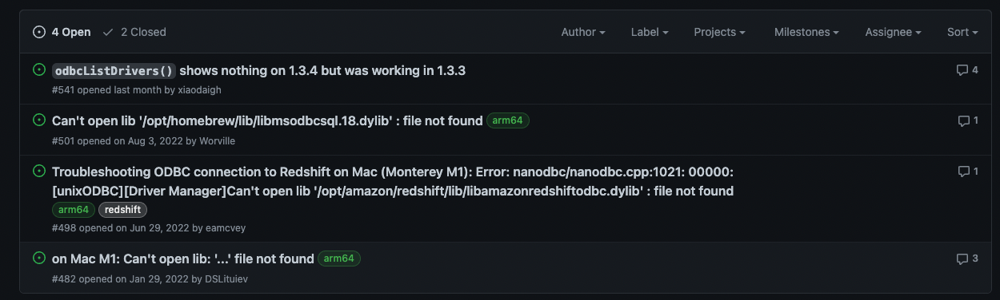
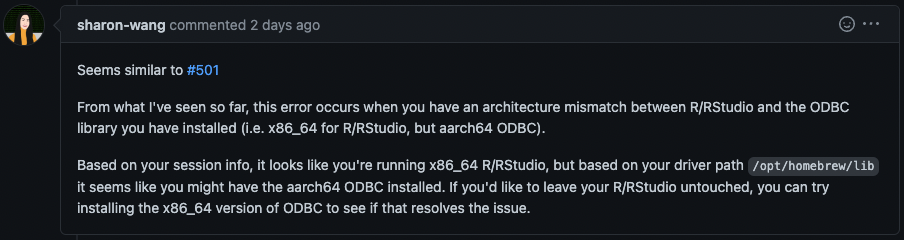

```{r setup, include = FALSE}
library(knitr)
library(kableExtra)
options(scipen = 1, digits = 3)
opts_chunk$set(comment=NA, warning = FALSE, message = FALSE)

```


First of all: I haven't written a blog post in quite some time. This has probably something
to do with me having started a new job last July. I'm working now as a Data Analyst at
Container xChange and that kept me rather busy. 
This post is about finally being able to connect to our Snowflake datawarehouse
after several hours (and days) of browsing through github issues and stackoverflow threads.
I almost gave up thinking "okay, I can use the snowflake python connector and won't query directly from R".
But let's start from the beginning...

When I started working at my new job, I received a Macbook. And to be more precise:
a Macbook Pro with an M1 processor. Previously I didn't have any experience working
with MacOS operating systems, but I felt that the switch was not too difficult.

<aside> It was mainly about getting used to copy and paste with command + c/v and not control + c/v. </aside>

The analytical datawarehouse our team used, was AWS Redshift. Naturally I wanted to
query tables directly from R and loved how easy that was with the {DBI}, {bigrquery} and {dbplyr} packages
at my last job.
After some googling I found a way to connect to our datawarehous and select
tables from specific schemas:

```{r eval=FALSE}
# Redhshift connection
library(DBI)

con <- dbConnect(RPostgres::Redshift(),
                 host = "123.45.67.890",
                 dbname = "db_name",
                 user = "admin",
                 password = rstudioapi::askForPassword("Database password"),
                 port = 1234)

table_a <- tbl(con, Id(schema = "xchange_123", table = "t_company"))
```

I was glad to find the `RPostgres::Redshift()` function that saved me from
downloading Redshift drivers and having to specify an odbc connection.
Fast forward to last November when we started to move our datawarehouse to dbt + Snowflake.
Unfortunately thinking that it shouldn't affect my workflows in R just because I was accessing
a different datawarehouse:


When first searching for a way to connect to Snowflake from R I found a couple
of posts where it looked fairly easy to do exactly that. 
One was from Martin Stingl on his [rstats-tips blog](https://rstats-tips.net/2022/02/07/accessing-snowflake-with-r/)
(highly recommended). And I also found a [post](https://community.snowflake.com/s/article/How-To-Connect-Snowflake-with-R-RStudio-using-RODBC-driver-on-Windows-MacOS-Linux) on community.snowflake.com 
titled *How To Connect Snowflake with R/RStudio using ODBC driver on Windows/MacOS/Linux*.
This too easy how to article consisted of 2 steps:

1. Create the ODBC DSN and test if it is working fine
2. Use this sample code:

```{r eval=FALSE}
install.packages(c("DBI", "dplyr","dbplyr","odbc"))
library(DBI)
library(dplyr)
library(dbplyr)
library(odbc)
myconn <- DBI::dbConnect(odbc::odbc(), "SNOWFLAKE_DSN_NAME", uid="USERNAME", pwd='Snowflak123')
mydata <- DBI::dbGetQuery(myconn,"SELECT * FROM EMP")
head(mydata)
```

I tried to configure an odbc dsn and connect to Snowflake, but sadly I just couldn't
find a way to do it. One of the good things about R is that things most of the
time just work out of the box (see `RPostgres::Redshift()`).
But here I faced many problems I couldn't solve which led me to ask many questions like: 

- Which driver should I install and where should I save it?
- Which packages to download for my M1 Macbook?
- Is aarch64 and arm64 the same thing?
- How to display hidden files? (SHIFT + CMD + .)
- What is the correct folder to place my .odbc.ini file?
- Why doesn't `odbc::odbcListDrivers()` list my drivers?
- What should be used - unixodbc or iODBC - and what is the difference?
- Does it have sth. to do with homebrew?
- What should I export to $PATH?
- What are symlinks and how to use them?
- Where lies the root of the problem?

When browsing through the web I felt somewhat reassured that apparently many people 
with an M1 Macbook have experienced similar problems.
I want to show some stops I did when browsing and searching for a solution.
Here follows a short list of posts that dealt with
what I thought was my issue:

**Stackoverflow**

- [Mac M1 Pro pyodbc Can't open lib](https://stackoverflow.com/questions/74279725/mac-m1-pro-pyodbc-unixodbcdriver-managercant-open-lib-opt-homebrew-lib-li)
- [R odbc::odbcListDrivers() does not list driver](https://stackoverflow.com/questions/69759250/r-odbcodbclistdrivers-does-not-list-dirver-in-opt-homebrew-etc-odbcinst-ini)
- [Unable to connect to PostgreSQL with ODBC in R on MacOS](https://stackoverflow.com/questions/75437010/unable-to-connect-to-postgresql-with-odbc-in-r-on-macos-monterey)

**RStudio/Posit Community**

- [Troubleshooting R <> Redshift connection via ODBC](https://community.rstudio.com/t/troubleshooting-r-redshift-connection-via-odbc/141183)
- [Connecting RStudio with Snowflake on MacBook M1](https://community.rstudio.com/t/connecting-rstudio-with-snowflake-on-macbook-m1/119608)
- [Can't open lib '/opt/homebrew/lib/libmsodbcsql.17.dylib' from M1 Mac ARM64](https://community.rstudio.com/t/cant-open-lib-opt-homebrew-lib-libmsodbcsql-17-dylib-from-m1-mac-arm64/122205)

**Github**

Currently there are [4 open issues](https://github.com/r-dbi/odbc/issues?q=is%3Aissue+is%3Aopen+m1) in the r-dbi/odbc repository dealing with what I assume
is the same issue. Just 2 days ago [Sharon Wang](https://github.com/sharon-wang) has created a [PR](https://github.com/r-dbi/odbc/pull/549) that addresses this as well (thanks a lot `r emo::ji("blush")`).



People have offered solutions that were helpful for some persons.
The sad thing however was that none of the posts have helped me with finding a solution.
I have already come to terms with it and on the plus side highly improved my SQL skills
`r emo::ji("smile")`. But today I sat down at my desk, had a coffee and checked again
these open odbc issues and found this new comment from Sharon Wang:
 


That somehow rang a bell which led me to [this](https://stackoverflow.com/questions/69275130/how-do-i-install-the-odbc-driver-for-snowflake-successfully-on-an-m1-apple-silic) stackoverflow post
titled *How do I install the ODBC driver for Snowflake successfully on an M1 Apple Silicon Mac?*
The second most upvoted answer from [Scott Brenstuhl](https://stackoverflow.com/users/4319571/scott-brenstuhl)
finally gave me the solution 
and I was able to connect to Snowflake.
This is basically what I had to do: 

1. Uninstall R and Rstudio (brew uninstall packagename)
2. Install Rosetta (apples software for translating between architectures) and a homebrew version built with it
3. Use this homebrew version to install odbc, R and Rstudio for x86_64 architecture
4. Install the snowflake driver (not the aarch one) in the default location (/opt/snowflake/snowflakeodbc/lib/universal/libSnowflake.dylib)
5. Modify the odbcinst.ini file under /usr/local/etc/odbcinst.ini
6. Modify the odbc.ini file under /usr/local/etc/odbc.ini
7. Modify the simba.snowflake.ini file (needs sudo command to change) under /opt/snowflake/snowflakeodbc/lib/universal/simba.snowflake.ini
8. Finally connect with `DBI::dbConnect(odbc::odbc(), "Snowflake Driver")`

In the end, I'm glad I found a solution, although it took me far too long.
Hopefully this post may help other people to stumble upon the correct
github/stackoverflow/positcommunity thread.


