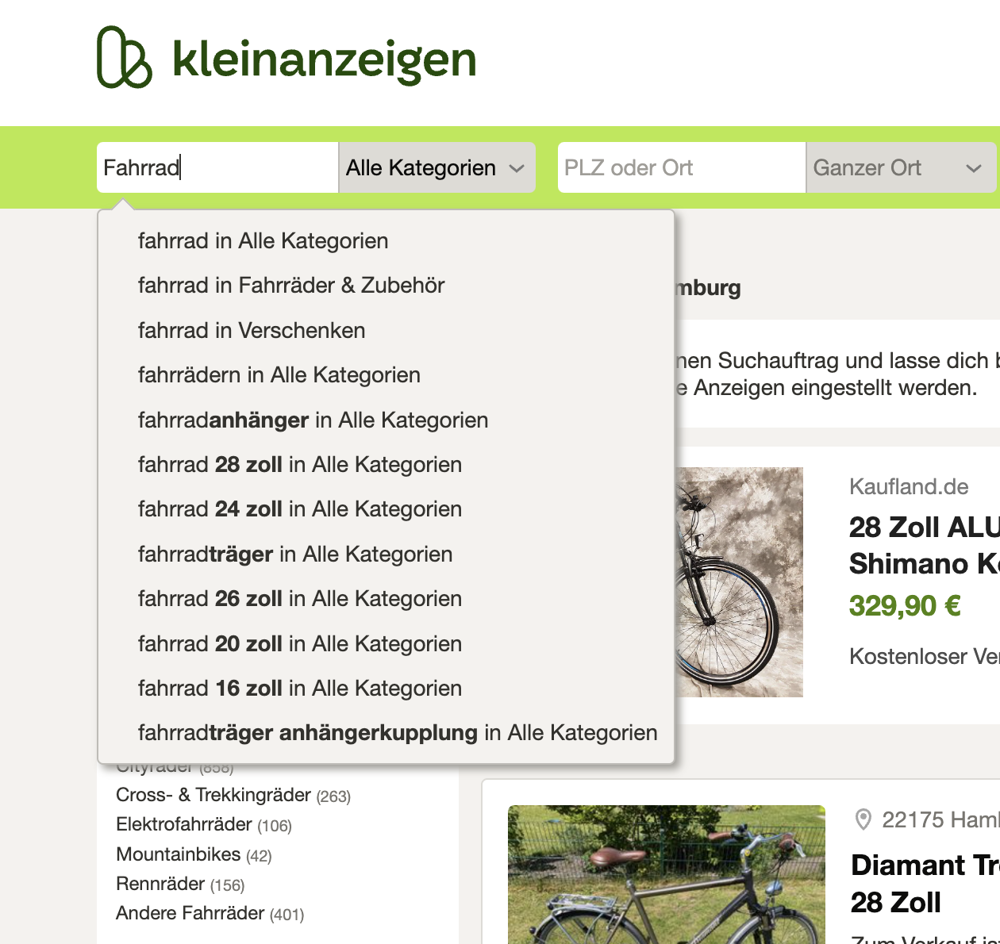
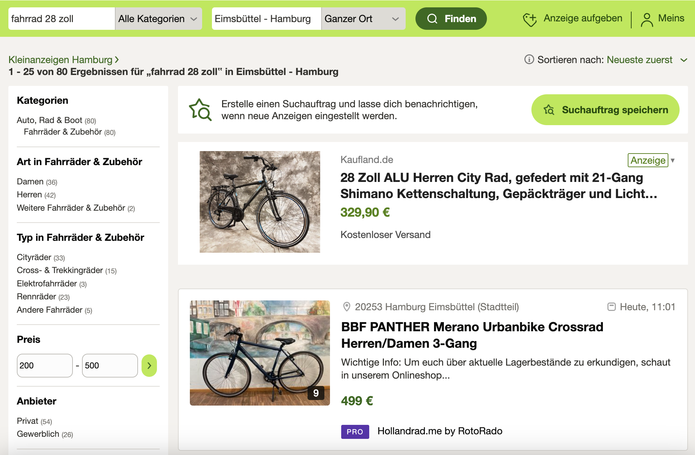

```{r setup, include = FALSE}
library(knitr)
library(kableExtra)
library(rmarkdown)
options(scipen = 1, digits = 3)
opts_chunk$set(comment=NA, warning = FALSE, message = FALSE)

```

This blog post will show how we can calculate user session_id's and group event data.
It will be illustrated with the help of R and SQL.


# The concept of a User Session

I'm working in the realm of (online) Data Analytics. That means I'm interested in analyzing
the behaviour of people who use our products and how they interact with it.
A helpful concept in this domain is that of a User Session.
Maybe u have heard about it, maybe not. But here u go:

> A session is a group of interactions between a user and an application that take place within a given timeframe. A single session can contain multiple activities (such as page views, events, social interactions, and e-commerce transactions)^[see https://auth0.com/docs/manage-users/sessions]

This concept leads to further metrics that are of interest such as the number of sessions, the average 
duration of a session or the probability of a user/customer performing certain actions within a session.
Let's take a simple example to illustrate this idea and narrow it down. 

# Searching in an online marketplace

Imagine I'm searching for a new bike and visit Kleinanzeigen.de 
(a german classifieds site where u can buy and sell pretty much anything). 
Typically I enter the thing of interest (here a bike) and get already proposals (see screenshot).
As soon as I click on any of these, the results load and are
displayed. This typically triggers an event that a user has done a search.



However for the process of finding a bike for me, it is probably not sufficient 
just to specify that I search for a bike. 
I will also want to include the location and possibly apply other filter options such as a price range.



After having entered the location of e.g. Hamburg-Eimsbüttel and defined a price range from
let's say 200 to 500 €, 
this resulted in multiple triggered search events.
But in a more general sense, we might argue that these events belong together and result 
in one search (session).
At this point we want to group these searches together and assign one session_id.
In order to make it easier to comprehend, I am creating dummy data of how
these searches may be stored.

# Calculating a session_id in R

```{r}
# required libraries
library(tidyverse)
library(dbplyr)
```

At first, I create a dataframe with 3 columns:

- a unique `search_id`
- a `user_id` to define who has done the search 
- a timestamp `created_at` to indicate the time when the search has been done


```{r}
# Create dummy data
searches <- tibble(search_id = 1:10, 
                   user_id = rep(c(1,2), each = 5), 
                   created_at = ymd_hms(
                        c("2023-06-03 08:10:00", "2023-06-03 08:10:08",
                          "2023-06-03 08:11:21", "2023-06-03 08:11:24",
                          "2023-06-03 08:11:33", "2023-06-03 08:10:48",
                          "2023-06-03 08:11:05", "2023-06-03 08:11:11",
                          "2023-06-03 08:12:13", "2023-06-03 08:12:20"))) |> 
  arrange(user_id, created_at)

```


```{r echo=FALSE}
searches |> 
  paged_table()
```

We've got 10 individual searches of 2 users. Each user has done 5 searches and
we want to know how to assign session_id's to these searches.
Maybe someone in our team has already done some research and came to the conclusion that it is
best to define the timeframe of a search session to be 10 seconds. 
This means if a subsequent search of a user is done within 10 seconds, these
belong to the same search session_id.

Therefore we want to first sort our data based on user_id and created_at.
Then we can calculate the time difference between searches.
In base R we've got the nice function `diff` which as the name suggests calculates the 
lagged difference.

```{r}
diff(c(1, 1, 3, 4, 2))
```

We have to pad the first value to get a vector of the same length.

```{r eval=FALSE}
searches |> 
  mutate(time_dif = c(0, diff(created_at)),
         time_dif_reset = if_else(time_dif >= 10, TRUE, FALSE),
         user_reset = if_else(c(1, diff(user_id)) != 0, TRUE, FALSE))
```


```{r echo=FALSE}
searches |> 
  mutate(time_dif = c(0, diff(created_at)),
         time_dif_reset = if_else(time_dif >= 10, TRUE, FALSE),
         user_reset = if_else(c(1, diff(user_id)) != 0, TRUE, FALSE)) |> 
  paged_table()
```

We added a boolean variable indicating whether the time difference between the
following search is greater than 10 seconds. If this is the case the session is
"reset" and starts again.
What we also have to account for is the fact that a new session starts for every
user. This can be achieved in a similar way.
Here we pad the first value of `user_reset` with a 1 because we want to start our session_id variable with 1.

What is now left is to combine these 2 `time_dif_reset` and `user_reset` variables
into a general `reset` variable (`time_dif_reset OR user_reset`). The cumulative sum of this variable will then give us our
desired session_id.


```{r eval=FALSE}
searches |> 
  mutate(time_dif = c(0, diff(created_at)),
         time_dif_reset = if_else(time_dif >= 10, TRUE, FALSE),
         user_reset = if_else(c(1, diff(user_id)) != 0, TRUE, FALSE),
         reset = if_else(time_dif_reset | user_reset, TRUE, FALSE),
         session_id = cumsum(reset)) 
```


```{r echo=FALSE, layout="l-body-outset"}
searches |> 
  mutate(time_dif = c(0, diff(created_at)),
         time_dif_reset = if_else(time_dif >= 10, TRUE, FALSE),
         user_reset = if_else(c(1, diff(user_id)) != 0, TRUE, FALSE),
         reset = if_else(time_dif_reset | user_reset, TRUE, FALSE),
         session_id = cumsum(reset))  |> 
  paged_table()
```

This tells us now that the first user has done 2 search sessions (session_id 1 and 2)
and the second user has done 3 search sessions (session_id 3, 4 and 5).
We would probably not divide this calculation into several steps, but 
combine them into a function.


```{r eval=FALSE}
# Put it into a function
create_session_id <- function(created_at, user_id, time_dif = 10) {
  return(cumsum(c(0, diff(created_at)) >= time_dif | 
                c(1, diff(user_id)) != 0))
}

searches |> 
  mutate(session_id = create_session_id(created_at, user_id))

```

# Calculating a session_id in SQL

Now we also look at how this can be accomplished in SQL. We'll 
create an in memory SQLite database table with our searches data.

```{r}
con <- DBI::dbConnect(RSQLite::SQLite(), dbname = ":memory:")

# Fill this with our searches data
copy_to(con, searches)

# SQL query to create session_id's
tbl(con, 
    sql(
        "
         with 
         searches_prep as (
            select 
                search_id,
                user_id,
                created_at,
                case when 
                    created_at - lag(created_at) over 
                        (partition by user_id order by created_at) >= 10 
                    or row_number() over 
                        (partition by user_id order by created_at) = 1
                    then 1 
                    else 0 
                end as reset
            from searches) 
         
         select 
            search_id,
            user_id,
            created_at,
            reset,
            sum(reset) over (order by user_id, created_at) as session_id
         from searches_prep
        "
        )) 
```

Here we're using a first CTE to create our reset variable similar to the way we have
defined it in R. We calculate the lagged difference by user_id and assign a 1 if 
it exceeds 10 seconds and for every first row of
a new user we assign a 1 as well.
In the bottom query we calculate the cumulative sum that gives us our session_id.

# Conclusion

We have looked at the important concept of User Sessions and at the logic of
how this can be calculated. The implementation was demonstrated with R as well
as with SQL and focused on the example of Searches done in an Online Marketplace.
This was a basic example and you would often add further conditions for specific cases.

These Session ID's can be viewed as a cornerstone on which to build 
further metrics of interest like the average session duration or a count of
specific events per session.


