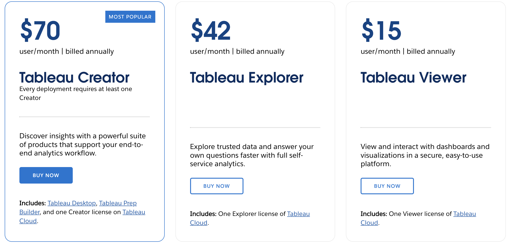
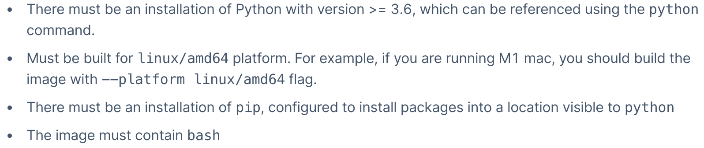
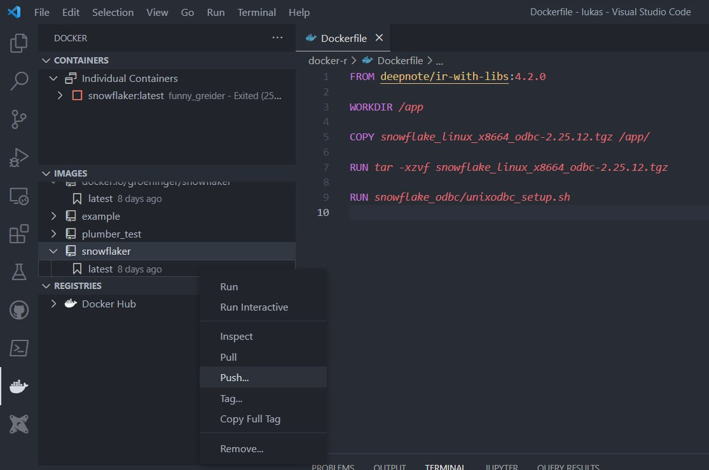
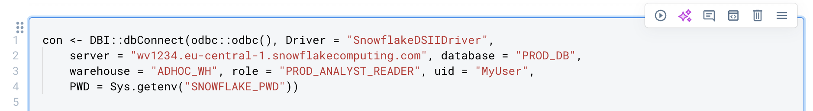

```{r setup, include = FALSE}
library(knitr)
library(kableExtra)
options(scipen = 1, digits = 3)
opts_chunk$set(comment=NA, warning = FALSE, message = FALSE)

```


This post will be about Data Science Notebook Tools and their limitations when it comes
to R support. Additionally I want to show how to create a custom Docker image with an
added Snowflake Driver to connect to database tables from within an R Deepnote notebook.


Why am I looking into Notebook tools in the first place? Because in our Data Team, 
we decided to move away from Tableau as our main 
Data visualization or BI tool and therefore explored other options. 


# Why did we decide to move away from Tableau?

There are several reasons leading to this step. One relatively obvious one is the high
price.



Tableau can be a costly investment for organizations, especially as the number of users increases.
Every user needs to have an account even if s/he only wants to view dashboards and is
not planning to create their own. Therefore it isn't easily possible to share 
links to dashboards to an entire organization. There are of course ways to share
accounts but this is not the intended use of this software.

Another point are the limited collaboration features.
Tableau's collaboration and sharing features have been improving over time, 
but they still fall short when compared to some of the newer BI tools. We'd like a 
platform that fosters collaboration, enables real-time sharing, and allows stakeholders to interact with the data directly.
Some modern BI tools provide better user management, real-time commenting, and collaborative features 
that streamline decision-making processes.

In the end we weren't able to leverage the potential of Tableau and bring its 
value to our entire organization.
This lead us to explore other options. 

# What else is out there?

One possibility is the combination of
a data science notebook tool for (advanced) data analyses or ad hoc reports as well 
as [Googles lookerstudio](https://lookerstudio.google.com) (which is free)
for standard visualizations and metrics.

We looked into multiple options and checked out tools like [Hyperquery](https://www.hyperquery.ai/), 
[Husprey](https://www.husprey.com/),
[Deepnote](https://deepnote.com/), [Noteable](https://noteable.io/) etc.
We're currently testing Deepnote further as it has SQL, Python as well as R
support and the option of scheduling notebooks. Additionally it seems that there is a decent
commenting and collaboration functionality. That means we can 
hopefully collaborate in real-time and share notebooks easily enabling seamless discussions and feedback. 
Team members as well as other stakeholders can leave comments directly on code cells, graphs 
or markdown sections, promoting communication which may lead to enhancing the overall quality of data analysis projects.

# R Support for Data Science Notebook Tools (Deepnote)

As described in a [previous post](https://lukas-r.blog/posts/2023-03-05-finally-solving-the-mac-m1-odbc-issue/)
we're working with a Snowflake/dbt datawarehouse setup and I'd like to do analyses in R. 
One requirement is that I can connect to database tables and access data directly within a notebook.
When testing notebook tools, I discovered that the support for the R language is
quite bad. The dominance of Python as the lingua franca of Data Science led to businesses focusing
on supporting mainly Python.


If they provide the option to also run R notebooks the set of features is incredibly limited. 
That usually means you cannot 

- run SQL as well as R cells in one notebook
- use the visualization options
- have a variable explorer
- query database tables

I posed a [question](https://community.deepnote.com/c/ask-anything/r-support-to-query-database-tables) 
in the deepnote community forum discussing the R support and a Customer Support Manager
confirmed that they are not actively working on improving the R experience.

# Custom Environments through Docker

One nice feature Deepnote offers is the possibility to use [custom environments](https://deepnote.com/docs/custom-environments) 
through Docker images. Here I thought this at least allowed me to avoid the shortcoming
of not being able to query snowflake db tables from within an R notebook.

They provide their own R docker images on [dockerhub](https://hub.docker.com/r/deepnote/ir-with-libs)
from which I can then add a snowflake odbc driver.
The requirements for the custom image is as follows:



## Creating a Docker Image

There are many wonderful blog posts, introductions and helpful links for using Docker:

- Colin Fay: [An Introduction to Docker for R Users](https://colinfay.me/docker-r-reproducibility/)
- [Docker for R Users Tutorial](https://www.youtube.com/watch?v=oehhZ98o6Zk)
- Peter Solymos: [Best Practices for R with Docker](https://hosting.analythium.io/best-practices-for-r-with-docker/)
- Matthew Kaye: [A Gentle introduction to Docker](https://matthewrkaye.com/posts/series/doing-data-science/2023-06-03-docker/docker.html)
- [The Rocker Project](https://rocker-project.org/)

First we'll create a new directory.

```{r}
#| eval: false
mkdir docker-r && cd docker-r
```

As we want to include a Snowflake odbc Driver we visit their [website](https://developers.snowflake.com/odbc/)
and select the relevant file that we want to download. In our case we need a driver built for the
Linux/amd64 platform (as seen in the requirements).
This means I'll download the `snowflake_linux_x8664_odbc-2.25.12.tgz` file (x86-64 is also known as x64, AMD64 or Intel 64) and save it
in my newly created `docker-r` folder. 

Then we'll need to create a Dockerfile. 
This will hold the instructions to build our image.
Below are the contents of this file:

```{r}
#| eval: false
FROM deepnote/ir-with-libs:4.2.0

WORKDIR /app

COPY snowflake_linux_x8664_odbc-2.25.12.tgz /app/

RUN tar -xzvf snowflake_linux_x8664_odbc-2.25.12.tgz 

RUN snowflake_odbc/unixodbc_setup.sh
```

When I unzipped the snowflake driver file I found the `unixodbc_setup.sh` 
bash script that had all the relevant instructions to install the driver.
To read the Dockerfile:

- We start from the base image of `deepnote/ir-with-libs:4.2.0`
- Then we copy our downloaded snowflake odbc driver file to the created `app` folder
- We unzip the file
- We run the `snowflake_odbc/unixodbc_setup.sh` shell script

## Building the Docker image and host it on Dockerhub

Now we've got everything we need to build our image. We need to make sure that
Docker Desktop is running (and has been installed previously)
Then we can run 

```{r}
#| eval: false
docker build --tag snowflaker .
```

If everything works well this builds our image. Afterwards we can run the image with 

<aside> If you're working on a M1 Mac Laptop you might want to follow [this](https://blog.jaimyn.dev/how-to-build-multi-architecture-docker-images-on-an-m1-mac/) 
post and use the `buildx` command. </aside>


```{r}
#| eval: false
docker run snowflaker
```

Then we can start R from within this container and check if the Driver is installed by typing in

```{r}
#| eval: false
odbc::odbcListDrivers()
```

To host our newly created image on Dockerhub, I like to use the VS-Code Docker extension.
There it is pretty straight forward. You can see on the left side all your
images and containers and can right click to push them to Dockerhub.



This should then push your image to Dockerhub ([here](https://hub.docker.com/repository/docker/groeninger/snowflaker/general) 
is the link to my image). In Deepnote you can point to your newly created
image and are now able to run an R notebook that has a Snowflake Driver installed which
lets you connect to the desired database table. 
One last step that is important is the handling of passwords. 
Here Deepnote offers the possibility to use [Environment Variables](https://deepnote.com/docs/environment-variables).

A code cell establishing a connection in an R notebook in Deepnote migth look like this:


With the help of `Sys.getenv("SNOWFLAKE_PWD)` we don't have to expose our password
in the notebook.

That's it! Now you're able to connect to your Snowflake DB tables from within an Deepnote
R notebook. 


