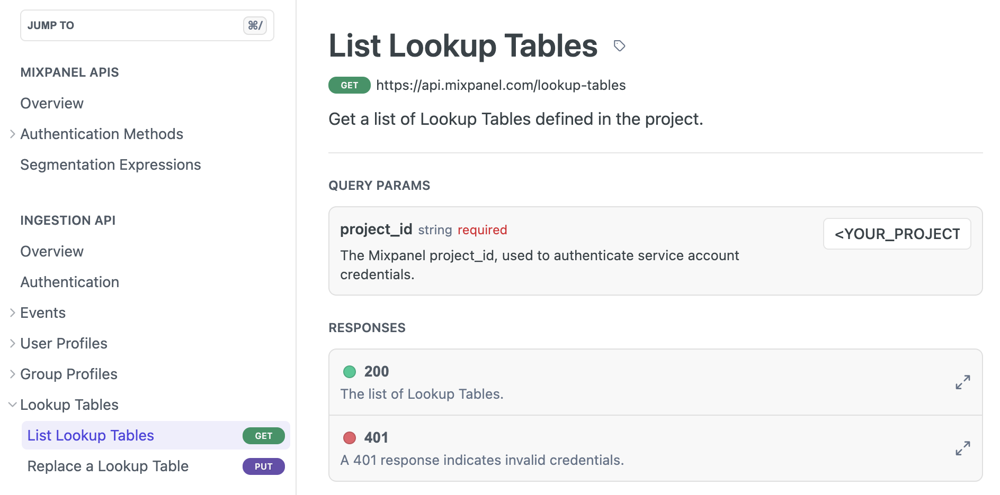

```{r setup, include = FALSE}
library(knitr)
library(kableExtra)
options(scipen = 1, digits = 3)
opts_chunk$set(comment=NA, warning = FALSE, message = FALSE)

```

# Enhancing Product Analytics Tools

Companies who offer digital products (like us) want to understand how users interact
with their products and services. It is important to understand what part of your
app or which features are the ones your customers are engaging with and
finding value in.
Therefore understanding user behavior and engagement is an important aspect to successful product development and business growth. 
This realization has given birth to a vibrant landscape of product analytics tools, each designed to unearth insights from user interactions, helping businesses fine-tune their strategies and offerings. 

## Event-Based Analytics

Today I want to highlight event-based Analytics with [Mixpanel](https://docs.mixpanel.com/docs/getting-started/what-is-mixpanel). 
Mixpanel has been around for
some years and it is the main tool with which our Product Managers analyze user pathways,
time spent on certain pages etc. I can't really say that it's the best tool that is out there,
but it's what we're working with.


Instead of just tracking page views or sessions, event-based analytics hones in on specific 
user actions or events that occur during a user's interaction with a website, app, or system
(in a [previous post](https://lukas-r.blog/posts/2023-06-03-searching-for-user-sessions/) 
I've already discussed the concept of user sessions).
An "event" is a user action or interaction with your product that you choose to track. 
These events can be virtually anything – clicking a button, signing up for a newsletter, adding items to a shopping cart, or even scrolling down a page. Essentially, events are custom-defined actions that are relevant to your specific goals and objectives.
In addition to that you can provide further properties and information tied to events.
As an example you might have a Social Media feed where users can like posts.
You could set up an event `Liked Post` where you would add further information about the 
nature of said post (e.g. a boolean flag whether this was an ad or contained an image).
In our company we're using Segment to store Frontend User tracking events that get then
sent to Mixpanel.

## Lookup Table Use Case

In order to get the best out of any analytics tool, the data basis must be good.
That means that there has to be a sound strategy of how the event tracking is set up
in the organization. As a data analyst, however, I have the opportunity to additionally 
improve or enhance the analytical capabilities of this tool. The example I want to highlight in
this post is how to leverage [Lookup Tables](https://docs.mixpanel.com/docs/tracking/how-tos/lookup-tables).
These let you enrich events with attributes about other entities (in my case companies).
Events are always tied to the user who performed the relevant action. But often
it might be beneficial to link information about other entities to properties.
To give an example: We still got our Social Media Site where people might subscribe to
different channels. We might want to link further information about the channel
to a potential event `Subscribed to Channel`
(which shouldn't be set as properties in the specific tracking event).
In this case Lookup Tables come in handy.

# Wrapping the Mixpanel API with R and {httr2}

The problem I want to solve is having up to date information in a Lookup table that I've setup
in Mixpanel for my colleagues to use. Therefore I want to setup a scheduled R notebook that's updating 
the relevant data on a daily basis. For the scheduled notebook I'm gonna use 
Deepnote (see [this](https://lukas-r.blog/posts/2023-07-29-r-support-for-data-science-notebook-tools/) previous post).

The Mixpanel Ingestion API offers [decent documentation](https://developer.mixpanel.com/reference/ingestion-api)
of how to interact with it. Now I only have to figure out how to best wrap it's functionality
into R functions. 

Authentication is an important issue when dealing with API's (I've written a bit about
API's in [this](https://lukas-r.blog/posts/2021-12-15-apis-and-parameterized-reports/) previous post). In order to provide the relevant credentials to 
authenticate yourself, a nice way is storing these in environment variables. 
[Here](https://daattali.gitbooks.io/stat545-ubc-github-io/content/bit003_api-key-env-var.html)
is a post that describes how to do exactly that.
Coming back to the Mixpanel Documentation. In order to use the Lookup Table endpoints,
I had to setup a Service Account for authentication. 
[Here](https://developer.mixpanel.com/reference/service-accounts) is a guide to set these up.
The following credentials are going to be used to interact with the API:

- SERVICE_ACCOUNT_NAME
- SERVICE_ACCOUNT_SECRET
- PROJECT_ID

I will be turning two endpoints into R functions. First the GET `List Lookup Tables` endpoint
under `https://api.mixpanel.com/lookup-tables` and second the PUT 
`Replace a Lookup Table` endpoint. 



I'm going to use the `{httr2}` package to deal with HTTP requests. The package website
is a great resource and even offers a [vignette](https://httr2.r-lib.org/articles/wrapping-apis.html) of how to wrap API's.
The main concept of the package is a pipeable request object (`request()`) where you add information
about authentication, headers, query parameters and method. In the end the request
gets performed (`req_perform()`) and you handle the response.

## The get_lookup_tables function

As the name suggests the get_lookup_tables function returns a list of available lookup tables
in your Project and their id's. The credentials are going to be passed as
default arguments in the function. 

```{r eval=FALSE}
get_lookup_tables <- function(mp_service_account_name = Sys.getenv("MP_SERVICE_ACCOUNT_NAME"),
                              mp_service_account_secret = Sys.getenv("MP_SERVICE_ACCOUNT_TOKEN"),
                              mp_project_id = Sys.getenv("MP_PROJECT_ID")) {
    
  checkmate::assert_character(c(mp_service_account_name, mp_service_account_secret,
                                  mp_project_id))
  
  resp <- httr2::request("https://api.mixpanel.com/lookup-tables") |> 
      httr2::req_auth_basic(username = mp_service_account_name,
                            password = mp_service_account_secret) |> 
      httr2::req_headers(accept = "application/json") |> 
      httr2::req_url_query(project_id = mp_project_id) |> 
      httr2::req_perform()
  
  tables <- resp |> httr2::resp_body_json() |> 
      (\(x) x$results )() |> 
      tibble::enframe(name = "n") |> 
      tidyr::unnest_wider(col = .data[["value"]])
  
  return(tables)
}
```

After building up the request by adding
authentication, headers and query parameter, I perform the request. 
Afterwards I have to do some data wrangling to convert the result into a tibble
that gets returned.

## The replace_lookup_table function

Now I have created a function to identify the `lookup_table_id` that is gonna be passed as
an argument in the main function that deals with updating said lookup table. 
In addition to the credentials I also have to add the `table_to_replace`
as an argument which should be a dataframe or tibble.

The `Replace a Lookup Table` endpoint uses a PUT method where I modify an existing object.
There are some requirements that need to be fulfilled when providing the lookup table data in order to successfully use the endpoint:

- The first column of the lookup table is assumed to be the ID of the row. 
- All ID values must be unique.
- The first row of the lookup table is a header row. The values in the header must be unique, as each one uniquely identifies a column of the table. These will appear as properties of the lookup table in Mixpanel's UI.
- The CSV must be valid according to RFC4180.

As I input a dataframe into the function, I'll have to format this input into
the required csv string. This get's done through the `readr::format_csv()` function.
Now I can build up my request object as done before. One important difference to the 
`get_lookup_tables` function is the PUT method that needs to be added.
The request gets performed and the returned object is the `{httr2}` response which
hopefully results in 200. 


```{r eval=FALSE}
replace_lookup_table <- function(mp_service_account_name = Sys.getenv("MP_SERVICE_ACCOUNT_NAME"),
                              mp_service_account_secret = Sys.getenv("MP_SERVICE_ACCOUNT_TOKEN"),
                              mp_project_id = Sys.getenv("MP_PROJECT_ID"),
                              lookup_table_id,
                              table_to_replace) {
    
    checkmate::assert_character(c(mp_service_account_name, mp_service_account_secret,
                                  mp_project_id, lookup_table_id))
    checkmate::assert_data_frame(table_to_replace)
  
    table_to_replace_csv <- readr::format_csv(table_to_replace, escape = "none")
    
    resp <- httr2::request("https://api.mixpanel.com/lookup-tables") |> 
        httr2::req_auth_basic(username = mp_service_account_name,
                              password = mp_service_account_secret) |> 
        httr2::req_headers(accept = "application/json",
                           `content-type` = "text/csv") |> 
        httr2::req_url_path_append(lookup_table_id) |> 
        httr2::req_url_query(project_id = mp_project_id) |> 
        httr2::req_body_raw(table_to_replace_csv) |> 
        httr2::req_method("PUT") |> 
        httr2::req_perform()
    
    return(resp)
}
```


# Putting it into a Package with {fusen}

Now that I successfully wrapped two API endpoints into R functions, I wanted to put these into a
package called `{mixpanelutils}` (you can find it on Github [here](https://github.com/L-Groeninger/mixpanelutils)). 
I really like the `{fusen}` [package](https://thinkr-open.github.io/fusen/) that let's you 
build an R package based upon an Rmarkdown file that get's "inflated".
The awesome thing is that it takes much of the pain and documentation efforts away.
I encourage you to watch [this](https://www.youtube.com/watch?v=febuOcS70t4) video on youtube to learn more.

The main thing that needs to be done is extending the functions I wrote with
some `{roxygen2}` tags. Here is the example for the `get_lookup_tables` function:


```{r eval=FALSE}
#' get_lookup_tables 
#'
#' @param mp_service_account_name The Mixpanel Service Account Name
#' @param mp_service_account_secret The Mixpanel Service Account Token
#' @param mp_project_id str The Mixpanel Project ID
#' 
#' @importFrom rlang .data
#' 
#' @return 
#' Tibble with information about Lookup tables
#' @export

get_lookup_tables <- function(mp_service_account_name = Sys.getenv("MP_SERVICE_ACCOUNT_NAME"),
                              mp_service_account_secret = Sys.getenv("MP_SERVICE_ACCOUNT_TOKEN"),
                              mp_project_id = Sys.getenv("MP_PROJECT_ID")) {
  ...
}
```

With `{fusen}` you will be walked through the process of doing the necessary steps
in order to have a wonderful tested (not in my case) and checked package hosted on Github.
You mainly have to follow along the `0-dev_history.Rmd` file.
It is obviously up to the author to provide further documentation, helpful vignettes etc., 
but you're already on a path to have a reliable package.
What I particularly like is the integration of `{pkgdown}` that lets you create
websites for your R package. You can find the website of `{mixpanelutils}` under
https://l-groeninger.github.io/mixpanelutils/. I only provided the bare minimum but
got a nice documentation set up.


# Conclusion

In this post I talked a bit about Product Analytics Tools and how these might 
be enhanced by us Data Analysts. I laid out the example of Mixpanel and how I setup
a scheduled notebook to update relevant information in Lookup tables on a daily basis for my
colleagues to use. 

I showed how to wrap API functionality into R functions using the `{httr2}` package. 
Afterwards I took the functions and created my own package `{mixpanelutils}`
with the help of `{fusen}` (shoutout to [Sébastien Rochette](https://github.com/statnmap)).
Maybe there is someone that finds the package useful.
Right now I have no intention to continue working on extending the package and wrap other
Mixpanel API endpoints, but who knows...


